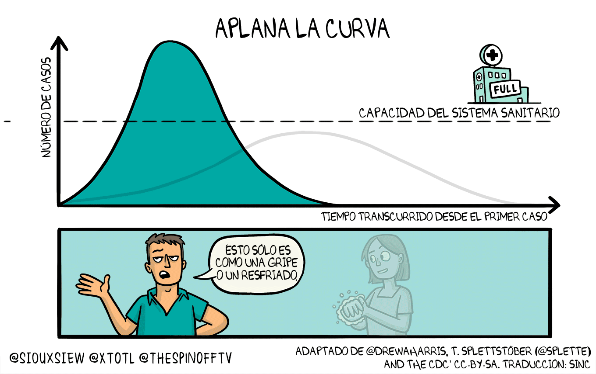
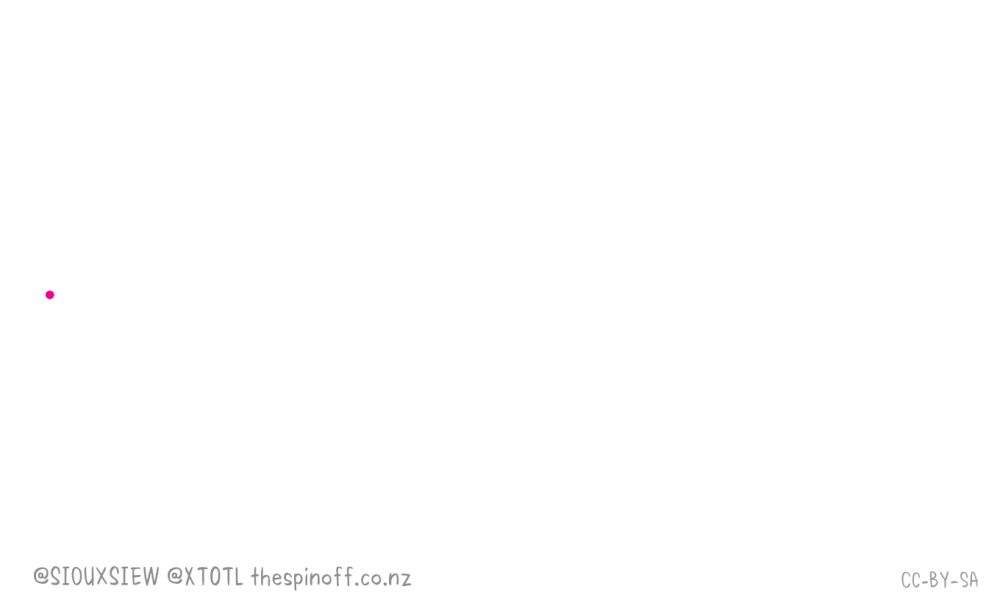
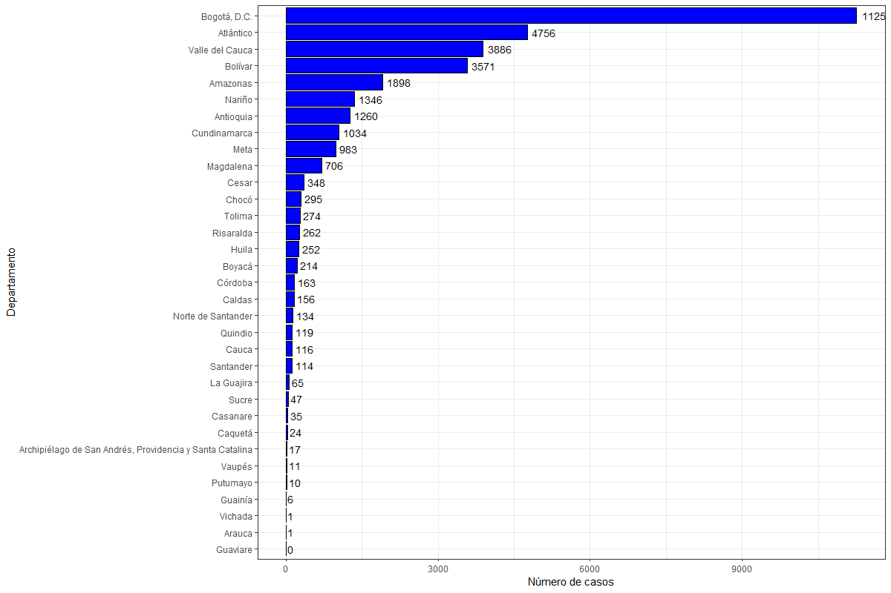
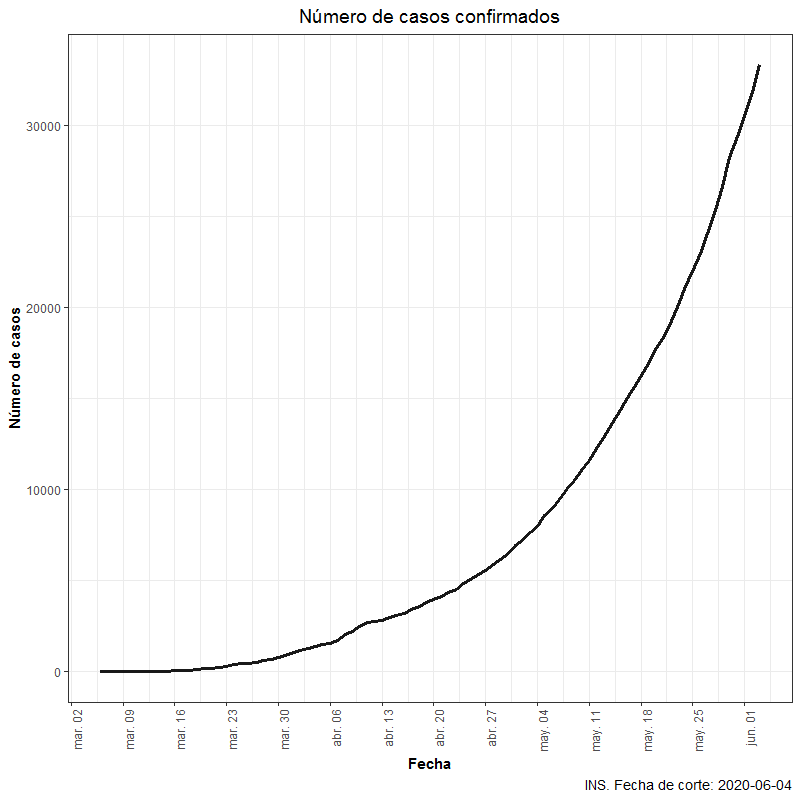
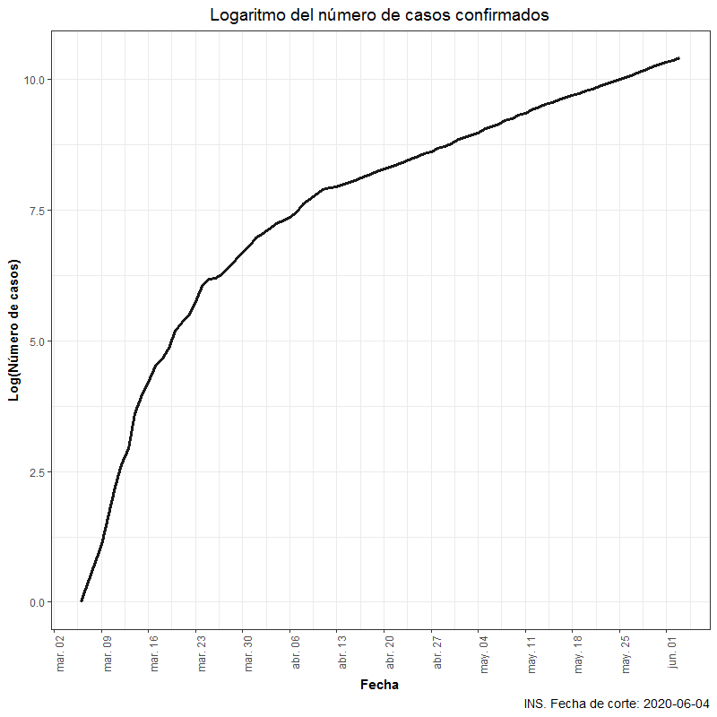

```{r setup, include=FALSE}
options(htmltools.dir.version = FALSE)
knitr::opts_chunk$set(warning = FALSE, message = FALSE, 
  comment = NA, dpi = 300, echo = FALSE,
  fig.align = "center", out.width = "60%", cache = FALSE,
  fig.path = "figs/")
library(tidyverse)
library(gganimate)
ozcols <- wesanderson::wes_palette("FantasticFox1")[c(2:3)]
```

# Introducción

La estadística es una ciencia que aporta en la toma de decisiones en diferentes sectores<sup>1
--

- Biología: análisis genético - `análisis de datos ómicos`.

--

- Sector Financiero: prevención de fraude - `phishing`.

--

- Marketing: decisiones de publicidad y mercadeo - `Brand Equity`, `Satisfacción de clientes`.

--

- Evaluación de políticas públicas.

--

- Evaluación de la educación: Pruebas `PISA`, `TRI`, cambio de cuadernillo en pruebas `Saber 11`.

--

- Salud: modelos en epidemiología, test de nuevos fármacos. 

.footnote[
[1] Los campos son mucho más amplios que los mencionados acá.
]
---
# Bioinformática

Los datos de expresión genética, en general son abiertos, [NIF](https://neuinfo.org//), [GEO](https://www.ncbi.nlm.nih.gov/), [FLOW](http://flowrepository.org/). Repositorio de [Bioconductor](https://bioconductor.org/install/) de `R`.

.pull-left[
```{r echo=FALSE, out.width="80%"}
knitr::include_graphics("images/Microarrays2.png")
```
]
--
.pull-right[ 

En general: 

- Comparar la expresión de un gen entre dos grupos.

- Encuentra secuencias de expresiones asociadas con cierto tipo de enfermedades.

- Cuantificación de una imagen.

- Valores de expresión.

- Se trata como un problema de grandes volúmenes de datos.

]
---

# Marketing

Las decisiones que se toman en marketing son diversas
```{r echo=FALSE, out.width="80%"}
knitr::include_graphics("images/Marketing.png")
```
---
# Evaluación de políticas públicas

```{r}
set.seed(1234)
x <- rnorm(1000, mean = 250, sd = 100) %>% as.data.frame()  %>% 
      mutate(tratado = ifelse(. > 348, 1, 0))

x1 <- subset(x, tratado == 1)
x2 <- subset(x, tratado == 0)

x1$y <- rnorm(nrow(x1), mean = 70, sd = 10) 
x2$y <- rnorm(nrow(x2), mean = 30, sd = 10)

df <- rbind(x1, x2)
colnames(df) <- c("x", "tratado", "y")
```

```{r, echo=TRUE, eval=FALSE}
df %>% 
  ggplot(aes(x, y, color = as.factor(tratado)))+
  geom_point() + geom_smooth( method = 'lm') + theme_bw() + theme(legend.position = "none")
```

.pull-left[
```{r, echo=FALSE}
df %>% 
  ggplot(aes(x, y, color = as.factor(tratado)))+
  geom_point() + geom_smooth( method = 'lm') + theme_bw() + theme(legend.position = "none")
```
]

.pull-right[ 

Problema de regresión discontínua **Ser Pilo Paga**, la variable $x$ representa el puntaje en la prueba `Saber 11` mientras que las variable $y$ representa alguna variable de resultado.

$$y_i = \alpha +\beta_1 x_i +\beta_2T_i + \epsilon_i$$
$$H_0: \beta_2 = 0; H_a: \beta_2 > 0 $$

- Considerar el ancho de banda.

- Medición de la línea de base.

]
---

# Evaluación de políticas públicas

Las investigaciones suelen ser de tipo experimental o cuasiexperimental, en estos casos se cuenta con un grupo control. _Programas como comedores comunitarios, familias en acción, vivienda gratuita, mejoramiento de barrios, entre otros._

.pull-left[
```{r echo=FALSE, out.width="100%"}
knitr::include_graphics("images/difdif.png")
```
]
--
.pull-right[ 

- El parámetro de interés es: 

$$\theta = (\mu_{T_2} - \mu_{T_1}) - (\mu_{C_2} - \mu_{C_1})$$

- La hipótesis nula es que el programa no genera ningún impacto.
$$H_0: \theta = 0$$

- La hipótesis nula es que existe un impacto del programa.

$$H_a: \theta > 0$$

- El efecto mínimo esperado $\Delta > 0$ y la potencia mínima esperada, son los valores a considerar en el cálculo del tamaño de la muestra. 

]

---

# Evaluación de la Educación

Pruebas **Saber 11** un cambio de más de 50 años

.pull-left[
```{r echo=FALSE, out.width="70%"}
knitr::include_graphics("images/cuadernillo.png")
```
]
--
.pull-right[ 
**Saber 11** calendario A: 
- Un millón doscientos mil estudiantes.
- Impresión `offset` por plancha y plegado.
- Impresión `digital` por cuartilla.
- 48 páginas, equivalentes a 12 cuartillas.
- Nombres y apellidos en todas las páginas.
- Tiempos de impresión y distribución de 25 días.
- Algoritmo basado en principios de `big data`.
]
---

# Salud: SARS-CoV-2
El caricaturista [Toby Morris](https://twitter.com/XTOTL) realizó la siguiente ilustración que muestra la forma como evoluciona la pandemia

```{r, out.width= '70%'}

```
---

# Tasa de reproducción
La tasa de reproducción $R_0$, se estima entre 2.5 y 3.5 para el SARS-CoV-2 [Spinoff](https://thespinoff.co.nz/) 

```{r, out.width= '70%'}

```
---
background-image: url(images/SarsCol.gif)
background-size: contain
---

# Número de casos por departamento
Los cálculos se realizaron usando los datos del [INS](https://www.ins.gov.co/Noticias/Paginas/Coronavirus.aspx). 33.354 casos confirmados al 03 de junio.

```{r echo=FALSE, out.width="68%"}

```

---

# Tasa por cada 100 mil habitantes
Los cálculos se realizaron usando los datos del [INS](https://www.ins.gov.co/Noticias/Paginas/Coronavirus.aspx)

```{r echo=FALSE, out.width="70%"}
knitr::include_graphics("images/tasa.png")
```
---
background-image: url(images/TasaDptal.gif)
background-size: contain
---

# Casos confirmados a nivel nacional
Crecimiento exponencial y escala logarítmica

.pull-left[
```{r echo=FALSE, out.width="90%"}

```
]
--
.pull-right[
```{r echo=FALSE, out.width="90%"}

```
]

---

# Seguimiento del SARS-CoV-2 en los últimos 30 días
Un gráfico de dos ejes puede representar más información

```{r echo=FALSE, out.width="78%"}
knitr::include_graphics("images/dual.png")
```

---
# Modelos


.pull-left[
*Modelos determinísticos*, Kermack \& McKendrick 1927<sup>1  

- SIR: Sanos, Infectados y Recuperados.
- SEIR: Agrega el compartimiento de expuestos.
- SEIRS: No supone inmunidad
```{r echo=FALSE, out.width="90%"}
knitr::include_graphics("images/SEIR.png")
```
.footnote[
[1] Imagen tomada de [data for science](https://medium.com/data-for-science)  .
]
]
--
.pull-right[ 
*Modelos estocásticos*
- [Institute for Health Metrics and Evaluation (IHME)](https://covid19.healthdata.org/colombia): propone un modelo con efectos mixtos no lineal que permite estimar la tasa de mortalidad, en la especificación del modelo se utiliza información sobre el distanciamiento social y covariables específicas sobre la ubicación.
- [Imperial College](https://www.imperial.ac.uk/mrc-global-infectious-disease-analysis/covid-19/report-13-europe-npi-impact/): proponen un modelo jerárquico bayesiano que permite estimar el número “real” de infectados además de inferir el impacto de las intervenciones no farmacéuticas para 11 países a partir de intervalos de credibilidad. 
]

---

class: center, middle

# Gracias!

Diapositivas realizadas con el paquete R [**xaringan**](https://github.com/yihui/xaringan).

---

class: inverse, right, bottom


# Encuéntrame en...

[`r icon::fa("twitter")` @jgbabativam](http://twitter.com/jgbabativam)  
[`r icon::fa("github")` @jgbabativam](http://github.com/jgbabativam)  
[`r icon::fa("paper-plane")` jgbabativam@usal.es](mailto:jgbabativam@usal.es)


