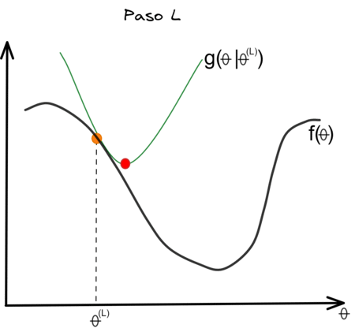

```{r setup, include = FALSE}
library(knitr)
library(tidyverse)
library(NHSRtheme)
library(xaringanExtra)
library(here)
library(kableExtra)
library(plotly)
library(BiplotML)
# set default options
opts_chunk$set(echo = FALSE,
               dpi = 300,
               fig.align = "center", out.width = "60%", cache = FALSE,
               fig.path = "figs/")

# uncomment the following lines if you want to use the NHS-R theme colours by default
# scale_fill_continuous <- partial(scale_fill_nhs, discrete = FALSE)
# scale_fill_discrete <- partial(scale_fill_nhs, discrete = TRUE)
# scale_colour_continuous <- partial(scale_colour_nhs, discrete = FALSE)
# scale_colour_discrete <- partial(scale_colour_nhs, discrete = TRUE)
ozcols <- wesanderson::wes_palette("FantasticFox1")[c(2:3)]

options(htmltools.dir.version = FALSE)
library(RefManageR)
BibOptions(check.entries = FALSE, bib.style = "authoryear", style = "markdown", dashed = TRUE)

bib <- ReadBib(here::here("References.bib"))
```

class: title-slide, left, bottom

# `r rmarkdown::metadata$title`
----
## **`r rmarkdown::metadata$subtitle`**
### `r rmarkdown::metadata$author`
### `r rmarkdown::metadata$date`

---

```{r xaringan-logo, echo=FALSE}
xaringanExtra::use_logo(
  image_url = "https://upload.wikimedia.org/wikipedia/commons/2/20/Universidad_de_Guayaquil.svg"
)
```


```{r}
# presionar w para encender o apagar la cámara durante la presentación
# Ctrl + Shift + w para cambiar de ubicación a la cámara durante la presentación
xaringanExtra::use_webcam()
```
# Agenda

.pull-left[

- **Introducción.**

- **Análisis de matrices binarias.**

- **Elección del número de dimensiones.**

- **Función sustituta.**

- **Algoritmos de estimación.**

- **Estudio de Monte Carlo y aplicación.**

- **Biplot logístico con datos faltantes.**

- **Aplicación.**

- **Paquete** `BiplotML`.

]

.pull-right[
```{r, out.width= '100%'}
knitr::include_graphics(here::here("talks/Ecuador/figs/LBTeor.png"))
```
]

---
class: inverse, center, middle
# INTRODUCCIÓN

---
# Métodos clásicos

```{r, out.width= '90%'}
knitr::include_graphics(here::here("talks/Ecuador/figs/Clasicos1.png"))
```

---
# Problema de optimización en ACP

```{r, out.width= '90%'}
knitr::include_graphics(here::here("talks/Ecuador/figs/Mindist1.png"))
```

---
# Análisis de Componentes Principales

```{r, out.width= '70%'}
knitr::include_graphics(here::here("talks/Ecuador/figs/ProcesoACP1.png"))
```

---
# Análisis de Componentes Principales

```{r, out.width= '95%'}
knitr::include_graphics(here::here("talks/Ecuador/figs/CargasACP1.png"))
```

---
# Análisis de Componentes Principales

```{r, out.width= '98%'}
knitr::include_graphics(here::here("talks/Ecuador/figs/RecACP1.png"))
```

---
# Métodos Biplot


.pull-left[

El biplot aproxima la distribución de una muestra multivariante en un espacio de dimensión reducida, normalmente de dimensión dos, superponiendo en la misma representación a las variables y los individuos (Gower 1996). Las variables normalmente se representan con vectores, y coinciden con las direcciones en las que mejor se muestra el cambio individual de cada variable.

El prefijo **"bi"** se refiere a la superposición, en la misma representación, de individuos y variables.

]

.pull-right[
```{r, out.width= '85%'}
knitr::include_graphics(here::here("talks/Ecuador/figs/figBiplot1.png"))
```
.right[(Cubilla-Montilla, 2021)]
]


---
# Biplot clásico

Sea $\mathbf{X}=\left(\mathbf{x}_1, \ldots, \mathbf{x}_n\right)^T$, con $\mathbf{x}_i \in \mathbb{R}^p$, $i=1, \ldots, n$, el objetivo es visualizar una matriz de datos mediante un sistema de coordenadas fila y columna. Si $rank(\mathbf{X})=r$ y asumiendo que las variables están centradas, las coordenadas del biplot se pueden calcular usando la SVD, $\mathbf{X}=\mathbf{U}\Lambda\mathbf{V}^T$. Así, $\mathbf{X}= \mathbf{AB^{T}+E}$ donde $\mathbf{E}$ es la matriz que contiene los errores de la aproximación.

--
<br><br>
Para un entero $k\leq r$, se obtiene la aproximación de rango $k$ más cercana a $\mathbf{X}$ como $\mathbf{\Theta} = \mathbf{U}_{(k)}\Lambda_{(k)}\mathbf{V}^T_{(k)}=\mathbf{AB}^T$, donde $\mathbf{A} =\mathbf{U}_{(k)}\Lambda_{(k)}^\gamma$ y $\mathbf{B}=\mathbf{V}_{(k)}\Lambda_{(k)}^{(1-\gamma)}, 0 \leq \gamma \leq 1$; de esta forma, $\mathbf{\Theta}$ minimiza
<br><br>
\begin{equation}
\left|\left|\mathbf{X}-\mathbf{\Theta}\right|\right|_F^2=\sum_{i=1}^{n}\left|\left|\mathbf{x}_i- \left(\mathbf{a}_{i1}\mathbf{b}_1+\ldots+\mathbf{a}_{ik}\mathbf{b}_k\right)\right|\right|^2.
\end{equation}
--
<br><br>
La matriz $\mathbf{X}$ entonces puede ser representada por marcadores $\mathbf{a_1, \ldots, a_n}$ para las filas y $\mathbf{b_1, \ldots, b_r}$ para las columnas, donde el $ij$-ésimo elemento de la matriz denotado $x_{ij}$ es aproximado por el producto $\mathbf{a^{T}_ib_j}$ y el espacio natural de parámetros está determinado por $\mathbf{\Theta} = \mathbf{A}\mathbf{B}^T$.

---
# Biplot clásico
```{r, out.width= '60%'}
knitr::include_graphics(here::here("talks/Ecuador/figs/BiplotClasicos.png"))
```

`r Citet(bib, "Villardon2006")`
`r Citet(bib, "Gabriel1971")`
`r Citet(bib, "Puri1986")`.
`r Citet(bib, "Demey")`
`r Citet(bib, "gabriel2002biplot")`
`r Citet(bib, "wold1978")`
`r Citet(bib, "bro2008")`
`r Citet(bib, "BabativaBiplotML")`

---
class: inverse, center, middle
background-image: url(figs/ImageBinary.png)
background-size: contain

---
# Biplot logístico para datos binarios

Sea $\mathbf{X}=\left(\mathbf{x}_1, \ldots, \mathbf{x}_n\right)^T$, con $rank(\mathbf{X})=r$ y $\mathbf{x}_i \in \{0, 1\}^p$, $i=1, \ldots, n$, $x_{ij} \sim Ber(\pi(\theta_{ij}))$, donde $\pi(\cdot)$ es la inversa de la función de enlace. Usando $\pi(\theta_{ij}) = \left\{1+exp(-\theta_{ij})\right\}^{-1}$, que representa la probabilidad de que la característica $j$ se encuentre presente en el individuo $i$.

--

<br>
Teniendo en cuenta que: $$P(X_{ij}=x_{ij}) = \pi(\theta_{ij})^{x_{ij}}\left( 1 - \pi(\theta_{ij})\right)^{1-x_{ij}}.$$

--

<br>
La función de verosimilitud es
<br>
$$\textit{L} (\mathbf{X}; \mathbf{\Theta}) = \prod_{i=1}^n\prod_{j=1}^p \pi(\theta_{ij})^{x_{ij}}\left( 1 - \pi(\theta_{ij})\right)^{1-x_{ij}}.$$
<br>
Y el negativo del log-verosimilitud se escribe como
<br>
$$\mathcal{L}\left(\mathbf{\Theta}\right) = -\sum_{i=1}^n\sum_{j=1}^p \left[ x_{ij} log(\pi(\theta_{ij})) + (1-x_{ij})log(1-\pi(\theta_{ij}))\right].$$

---

# Biplot logístico para datos binarios

En este caso **no es apropiado centrar las columnas** porque la matriz centrada ya no está formada por unos y ceros, entonces se extiende la especificación del espacio de parámetros al introducir el vector de desplazamiento $\mu$ y obtener un centrado basado en el modelo. 

--

La matriz canónica de parámetros $\mathbf{\Theta}=\left(\boldsymbol{\theta}_1, \ldots, \boldsymbol{\theta}_n \right)^T$ puede ser representada en una estructura de baja dimensión por algún entero $k \leq r$ que satisface $$\boldsymbol{\theta}_{i} = \boldsymbol{\mu} + \sum_{s=1}^ka_{is}\mathbf{b}_s, \hspace{0.5cm} i=1, \ldots, n.$$ 


Que expresado en forma matricial se escribe como

$$\mathbf{\Theta} = logit\left(\mathbf{\Pi}\right) = \mathbf{1}_n \mu^T + \mathbf{AB}^T,$$

donde $\mathbf{1_n}$ es un vector $n$-dimensional de unos; $\boldsymbol{\mu} = \left(\mu_1, \ldots, \mu_p\right)^T$; $\mathbf{A}=\left(\mathbf{a_1, \ldots, a_n}\right)^T$ con $\mathbf{a_i} \in \mathbb{R}^k, i=1, \ldots, n$;  $\mathbf{B}=\left(\mathbf{b_1, \ldots, b_k}\right)$ con $\mathbf{b_j} \in \mathbb{R}^p, j=1, \ldots, k$; y $\mathbf{\Pi}=\pi\left(\mathbf{\Theta}\right)$ es la matriz de probabilidades esperada cuyo $ij$-ésimo elemento es igual a $\pi(\theta_{ij})$. 

--
<br><br>
Entonces, $\mathbf{\Theta} = logit(\mathbf{\Pi})$ es un biplot en escala logit y el log-odds es $\theta_{ij} = \mu_j + \mathbf{a}_i^T\mathbf{b}_j$.  

---
# Geometría del Biplot Logístico
Al fijar los marcadores fila $\mathbf{A}$ y ajustar el modelo logístico para $k=2$, se obtienen las superficies de respuesta.
<br><br>

.pull-left[
```{r, out.width= '75%', fig.cap="Tomado de Vicente-Villardón (2020)"}
knitr::include_graphics(here::here("talks/Ecuador/figs/SuperficieLB.PNG"))
```
]

--
.pull-right[
```{r, out.width= '100%', fig.cap="Tomado de Vicente-Villardón (2020)"}
knitr::include_graphics(here::here("talks/Ecuador/figs/SuperficieLBPlanos.png"))
```
]

---
# Geometría del Biplot Logístico
Al fijar los marcadores fila $\mathbf{A}$ y ajustar el modelo logístico para $k=2$, se obtienen las superficies de respuesta.

.pull-left[
```{r, out.width= '95%', fig.cap="Tomado de Hernández (2016)"}
knitr::include_graphics(here::here("talks/Ecuador/figs/SuperficieLB2var.png"))
```
]

--
.pull-right[
```{r, out.width= '85%', fig.cap="Elaboración propia"}
knitr::include_graphics(here::here("talks/Ecuador/figs/LBTeor.png"))
```
]

---
# Geometría del Biplot Logístico

```{r LB3D, eval=requireNamespace("plotly", quietly=TRUE), fig.height=6, fig.width=9.5, echo=FALSE}
df<-data.frame(fpergandei=c(0,0,0,0,0,0,0,0,1,1,1,1,0,0,0,0,1,1,1,1,1,1,1,1,1,1,1,1,1,1,1,1),
               mintemp2=c(1.29569224,1.40509105,0.74869815,1.51448987,2.49907923,-1.00168292,
                          -0.01709357,-0.34529002,-0.56408765,-0.01709357,0.20170407,0.42050170,-1.00168292,
                          -1.98627227,0.09230525,-0.23589120,-0.78288528,-0.89228410,-0.01709357,1.95208514,
                          0.31110289,0.31110289,0.09230525,0.96749579,-0.23589120,-0.01709357,-1.22048055,
                          -0.23589120,-0.45468883,-0.67348647,-1.65807582,-0.45468883),
               moist2=c(0.24947803,-1.17491998,0.05498936,-1.58242006,-1.46943140,2.16472842,1.64979649,
                        1.65535331,-1.00821540,0.40506897,-0.22840843,-0.28027207,0.92370544,1.04039865,
                        1.36639871,1.32564870,-0.18210160,-0.25248798,-0.81557900,-0.72481762,-1.75282919,
                        -0.58219259,-0.27286298,-0.07281749,0.07536436,-0.04688566,-0.41363574,-0.54699940,
                        -0.19691978,0.89036452,0.84035315,-1.03785177))


mylogit <- glm(fpergandei ~ mintemp2 + moist2, 
               data = df,
               family = "binomial")


press_grid <- seq(-2.2, 2.2, by = 0.1)
v_grid <- seq(-2.2, 2.2, by = 0.1)
newdat <- expand.grid(press_grid, v_grid)  #the grid results in the same values as the newdat in the OP
colnames(newdat) <- c("mintemp2", "moist2")

pred <- predict.glm(mylogit, newdata = newdat, type="link", se=TRUE)

ymin <- mylogit$family$linkinv(pred$fit - 1.96 * pred$se.fit)
ymax <- mylogit$family$linkinv(pred$fit + 1.96 * pred$se.fit)
fit <- mylogit$family$linkinv(pred$fit) 
z <- matrix(fit, length(press_grid))
resp <- ifelse(z>0.5, 1, 0)

pp <- plot_ly(x = press_grid, y = v_grid) %>% 
  add_surface(z = z,
              colorscale = list(c(0,1),c("blue","red"))) 


x1 = seq(-2, 0, by=0.0202)
y1 = seq(-2, 0, by=0.0202)
z1 = exp(-0*(x1^0+y1^0))
df = data.frame(x1, y1, z1)
names(df) <- c("Dim1", "Dim2", "Prob")
line = list(color = "black", width = 4)

g <- plot_ly(x = press_grid, y = v_grid) %>% 
  add_surface(z = z,
              colorscale = list(c(0,1),c("red", "blue"))) |> 
add_trace(x = ~Dim1, y = ~Dim2, z = ~Prob, data = df, 
          type="scatter3d", mode="lines", linetypes = NULL,
          line = list(color = "black", width = 4))
htmltools::save_html(g, file="bip3D.html")
```

<div align="center"><iframe src="bip3D.html" width="700" height="400" scrolling="yes" seamless="seamless" frameBorder="0"> </iframe>

.left[La longitud del segmento depende de la velocidad con que crece la probabilidad, así que podría interpretarse como el poder discriminante.]

---
# Geometría del Biplot Logístico

La dirección que proyecta los marcadores de $\mathbf{A}$ que predicen los valores de la columna $j$ para una probabilidad fija $\pi$ cuando $k=2$, se presenta en .blue[Vicente-Villardón y col. (2006)]. El punto $(d_{j1}, d_{j2})$ que predice $\pi$ y que está en el eje biplot, es decir, en la recta que une los puntos $(0, 0)$ y $(b_{j1}, b_{j2})$, se calcula como

<br><br>

$$d_{j1}=\frac{(logit(\pi) - \mu_{j})b_{j1}}{\sum_{s=1}^2 b_{js}^2}, \hspace{1cm} d_{j2}=\frac{(logit(\pi) - \mu_{j})b_{j2}}{\sum_{s=1}^2 b_{js}^2}$$

--
<br><br>

En el modelo LB, como en el biplot PCA, todas las direcciones pasan por el origen. En un biplot PCA para datos centrados, el origen representa la media de cada variable y la dirección del segmento representa hacía donde crecen los valores. Como en el modelo LB no se pueden centrar los datos (mantenemos el término de desplazamiento de columna en el modelo), el origen no representa ningún valor particular de la probabilidad y las variables se representan con segmentos que regularmente inician en el punto que predice una probabilidad de $0.5$ y finalizan en el punto que predice $0.75$, estos valores son ajustables y dependerá del análisis que se pretenda en cada caso.

---
# Estimación de los parámetros del modelo

A diferencia del biplot clásico, en este caso no es posible obtener una solución directa al problema de minimización. 
.blue[Vicente-Villardón y col. (2006)] proponen un esquema iterativo alternando la actualización de las matrices $\mathbf{A}$ y $\mathbf{B}$ hasta que se alcanza un nivel de precisión previamente definido. El procedimiento es:

--
<p><br>

1. Asignar valores iniciales para la matriz $\mathbf{A}$.
2. Ortonormalizar $\mathbf{A}$ (opcional).
3. **Paso de regresión**: Calcular $\mu_j$ y $b_{j1},\ldots,b_{jk}$ usando regresiones logísticas separadas tomando cada $\mathbf{x}_j$ como la variable dependiente y la matriz $\mathbf{A}$ como las variables independientes.
4. **Paso de interpolación**: Interporlar cada individuo por separado (calcular $a_{i1},\ldots,a_{ik}$) usando el método de Newton–Raphson.
5. Si el cambio en $\mathcal{L}\left(\mathbf{\Theta}\right)$ es pequeño, entonces finalizar; de lo contrario se debe regresar al paso 2.

--
<p><br>

Este algoritmo tiende a ser muy .red[costoso computacionalmente], especialmente porque en el paso de interpolación también se debe iterar.

---
# Biplot logístico externo

.blue[Demey y col. (2008)] proponen utilizar un procedimiento externo para encontrar los marcadores de las filas y luego usar la regresión logística para encontrar los marcadores de las columnas. El procedimiento es:

--
<p><br><br>

1. Realizar un análisis de coordenadas principales (PCoA) sobre la matriz $\mathbf{X}$ y así encontrar la configuración $\mathbf{A}$ en un espacio euclideano de dimensión $k$, cuya matriz de distancia entre puntos esté lo más cercano posible a
la matriz de disimilaridades o distancias entre las $n$ filas.
2. Calcular $\mu_j$ y $b_{j1},\ldots,b_{jk}$ usando regresiones logísticas separadas tomando cada $\mathbf{x}_j$ como la variable dependiente y la matriz $\mathbf{A}$ como las variables independientes.

--

<p><br><br>
Realizar PCoA implica calcular una matriz $\mathbf{S}$ que contiene las similaridades entre las $n$ filas de la matriz binaria $\mathbf{X}$, que puede ser .red[costoso computacionalmente] cuando el volumen de datos es muy grande.

---
# Biplot logístico externo

```{r, out.width= '90%'}
knitr::include_graphics(here::here("talks/Ecuador/figs/9 BipLogExt.png"))
```

---
class: inverse, center, middle
# ELECCIÓN DEL NÚMERO DE DIMENSIONES DEL MODELO

---
# Algoritmo basado en un método de validación cruzada

<br>

- Cada algoritmo permite llegar a una estimación de $\boldsymbol{\hat{\mu}}$, $\mathbf{\hat{A}}$ y $\mathbf{\hat{B}}$, y se calcula $\mathbf{\hat{\Theta}} = \mathbf{1}_n\boldsymbol{\hat{\mu}}^T + \mathbf{\hat{A}\hat{B}}^T$, y usando la matriz de probabilidades estimadas $\mathbf{\hat{\Pi}}=\pi\left(\mathbf{\hat{\Theta}}\right)$ se puede llegar a la matriz predicha $\mathbf{\hat{X}}$.
--
<p>

- Para evaluar el rendimiento se seleccionan $p$ umbrales, $0<\delta_j<1, j=1,...,p$, uno por cada variable de la matriz $\mathbf{X}$, y luego aplicar la regla de clasificación a partir de la matriz de probabilidades estimadas.
--
<p>

- Dado que las clases de la matriz binaria $\mathbf{X}$ pueden estar desequilibradas. El error de entrenamiento se calcula usando la medida de tasa de error equilibrada (TEE).
--
<p>

- El umbral para la variable $j$ se define como el valor $0<\delta_j<1$ donde la $TEE$ para dicha variable es mínima:

$$\delta_j = \mathop{\arg \min}\limits_{\delta} \left\{TEE(\mathbf{x}_j|\delta): 0<\delta<1\right\}, \hspace{0.2cm}j=1,\ldots, p.$$
---
# Tasa de error equilibrada (TEE)

```{r tab_clas, echo=FALSE}
tab_clasif <- tribble(
~ "Valor predicho",  ~"1", ~"0",
"1", "VP", "FP",
"0", "FN", "VN"
)
knitr::kable(tab_clasif,  align = "ccc", caption = "Matriz de confusión.", escape = FALSE, booktabs = T) %>%
  add_header_above(c(" ", "Valor real" = 2)) %>%  
kable_styling(position = "center", latex_options = c("hold_position", "repeat_header"), repeat_header_text = "continuación")
```

--
<br>
La precisión equilibrada se basa en la *sensibilidad* y en la *especificidad*:

\begin{align}
Sensibilidad &= \frac{VP}{VP + FN}. \\[0.3cm]
Especificidad &= \frac{VN}{VN + FP}. \\[0.3cm] 
TPE &= \frac{1}{2}\left(\frac{VP}{VP + FN} + \frac{VN}{VN + FP}\right).
\end{align}

La **tasa de error equilibrada** es $TEE = 1 - TPE$.
---
# Cantidad de ejes a retener


- En los métodos clásicos, criterios basados en los valores propios o en el porcentaje de varianza explicada son regularmente utilizados como medida intuitiva para la selección de $k$. 

--

- Cuando la matriz de datos en binaria, se puede medir la capacidad de predicción de las variables utilizando el pseudo R cuadrado de Nagelkerke, AIC, BIC o cualquier medida de ajuste utilizada tradicionalmente en la regresión logística. Sin embargo, estos métodos no determinan el valor apropiado de $k$ antes de ajustar el modelo. 
--

- En este caso, la matriz canónica de parámetros $\mathbf{\Theta}=\left(\boldsymbol{\theta}_1, \ldots, \boldsymbol{\theta}_n \right)^T$ puede ser representada por marcadores fila y marcadores columna para algún entero $k \leq r$ que satisface que $\boldsymbol{\theta}_{i} = \boldsymbol{\mu} + \sum_{s=1}^ka_{is}\mathbf{b}_s$, $i=1, \ldots, n$. De modo que, estimar un valor apropiado para $k$ es un aspecto clave que influye en la especificación del modelo, que podría considerarse como un hiperparámetro del mismo. 

---
# Validación cruzada en modelos supervisados

```{r, out.width= '90%'}
knitr::include_graphics(here::here("talks/Ecuador/figs/ValidaCruzReg.png"))
```
--
<br><br>

Al omitir algunas filas del conjunto de datos, en los modelos supervisados no se afecta el espacio de parámetros del modelo (vector $\boldsymbol{\beta}$). Sin embargo, este procedimiento de validación cruzada, no se puede adaptar con facilidad a los métodos biplot.
---
# Validación cruzada en modelos supervisados

```{r, out.width= '52%'}
knitr::include_graphics(here::here("talks/Ecuador/figs/MFoldsRegresion.png"))
```
<br><br>

Al omitir algunas filas del conjunto de datos, en los modelos supervisados no se afecta el espacio de parámetros del modelo (vector $\boldsymbol{\beta}$). Sin embargo, este procedimiento de validación cruzada, no se puede adaptar con facilidad a los métodos biplot.
---
# Validación cruzada en métodos biplot

**Problema de aplicar la validación cruzada de la forma tradicional en los métodos biplot**
<br><br>

```{r, out.width= '80%'}
knitr::include_graphics(here::here("talks/Ecuador/figs/BiplotELIM.png"))
```

<br>
No se pueden estimar todos los elementos del espacio de parámetros.

---
# Validación cruzada en métodos biplot

.blue[Wold (1978)]: Patrón de eliminación disperso o diagonal para identificar la cantidad de dimensiones en un PCA. 

```{r, out.width= '35%'}
knitr::include_graphics(here::here("talks/Ecuador/figs/Wold_Kfold.png"))
```
--
<br>

.blue[Bro y col. (2008)] sugieren utilizar $M=7$ pliegues. .blue[Gabriel(2002)] propone un método de validación bi-cruzada (BCV), omitiendo simultáneamente una fila y columna. 
---
# Validación cruzada para el modelo LB

El procedimiento para encontrar el valor apropiado de $k$ en el modelo LB consiste en

- Generar $M$ segmentos usando un esquema de eliminación diagonal para evitar la eliminación de filas o columnas completas.
--

- En el segmento $m$, se divide la matriz $\mathbf{X}$ en $\mathbf{X}^{(-m)}$ y $\mathbf{X}^{(m)}$, donde $\mathbf{X}^{(-m)}$ contiene todas las observaciones excepto las omitidas, mientras que $\mathbf{X}^{(m)}$ contiene solo las observaciones omitidas.
--

- Construir la matriz binaria $\mathbf{W}$ donde $w_{ij}=0$ si $x_{ij}$ es excluido y $w_{ij}=1$ en otro caso.
--

- Para un valor fijo $k$, ajustar el modelo LB teniendo en cuenta solo las entradas conocidas.
$$-log(p(\mathbf{X}; \mathbf{\Theta}, \mathbf{W}))= -\sum_{i=1}^n\sum_{j=1}^p w_{ij} \left[ x_{ij} log(\pi(\theta_{ij})) + (1-x_{ij})log(1-\pi(\theta_{ij}))\right]$$
--

- Predecir los valores eliminados de la matriz de datos usando el modelo ajustado teniendo en cuenta los umbrales $\delta_j$ determinados para cada variable.

--
- Cacular la $TEE$ con los datos de prueba (_cv error_) y con la matriz completa (_error de entrenamiento_).

--
- Repetir el procedimiento $M$ veces.

---
```{r echo=FALSE, out.width="42%"}
knitr::include_graphics(here::here("talks/Ecuador/figs/FlowCV_LB.png"))
```
---
class: inverse, center, middle
# FUNCIÓN SUSTITUTA PARA UN BIPLOT LOGÍSTICO

---
# Método MM

La idea es **sustituir el problema de optimización por otro más simple** y que conduzca a la misma solución. El método MM es iterativo y funciona en dos pasos, uno de Mayorización y otro de Minimización. 
<br>

1. La función $g\left(\boldsymbol{\theta}|\boldsymbol{\theta}^{(l)}\right)$ es una función mayorizada o sustituta de $f(\boldsymbol{\theta})$ en el punto $\boldsymbol{\theta}^{(l)}$ si
\begin{align}
f(\boldsymbol{\theta}^{(l)}) & = g(\boldsymbol{\theta}^{(l)}|\boldsymbol{\theta}^{(l)})\\ 
f(\boldsymbol{\theta}) & \leq g(\boldsymbol{\theta}|\boldsymbol{\theta}^{(l)}) \hspace{0.3cm} \text{para todo } \boldsymbol{\theta} 
\end{align}

--

2. El algoritmo de minimización se aplica sobre la función mayorizada sustituta  $g\left(\boldsymbol{\theta}|\boldsymbol{\theta}^{(l)}\right)$, en lugar de la función objetivo inicial. Esto produce el siguiente punto a evaluar $\boldsymbol{\theta}^{(l+1)}$.

--
<br>

3. Si $\boldsymbol{\theta}^{(l+1)}$ representa el mínimo de la función sustituta $g\left(\boldsymbol{\theta}|\boldsymbol{\theta}^{(l)}\right)$, entonces el método MM lleva a $f(\boldsymbol{\theta})$ en **dirección descendente** con cada iteración. De esta forma, se cumplen las desigualdades
 
$$f\left(\boldsymbol{\theta}^{(l+1)}\right) \leq g\left(\boldsymbol{\theta}^{(l+1)}|\boldsymbol{\theta}^{(l)}\right) \leq g\left(\boldsymbol{\theta}^{(l)}|\boldsymbol{\theta}^{(l)}\right) = f\left(\boldsymbol{\theta}^{(l)}\right).$$

---
class: center, middle
# .left[Método MM]



<br> <br>

.left[El método usa la función sustituta para encontrar el mínimo de la función objetivo.]

---
# Función sustituta para un biplot logístico

Para $\mathcal{L}\left(\mathbf{\Theta}\right) = \sum_{i=1}^n\sum_{j=1}^p f(\theta_{ij})$, con función de enlace logit, $\pi(\theta_{ij})=(1-\exp(-\theta_{ij}))^{-1}$, el gradiente es:
<br><br>

\begin{align}
\nabla f(\theta_{ij}) & = -\left[x_{ij} \frac{1}{\pi(\theta_{ij})}\frac{\partial \pi(\theta_{ij}) }{\partial \theta_{ij}} + (1-x_{ij})\frac{1}{1-\pi(\theta_{ij})}\frac{\partial (1-\pi(\theta_{ij})) }{\partial \theta_{ij}}\right] \\
& = -\left[x_{ij} (1 - \pi(\theta_{ij}))  - (1-x_{ij})\pi(\theta_{ij})\right]\\
& = \pi(\theta_{ij})-x_{ij}. 
\end{align}

--
<br>

La segunda derivada, $\nabla^2 f(\theta_{ij}) = \pi(\theta_{ij})(1 - \pi(\theta_{ij}))$ que es una **función cuadrática** que satisface que $0 \leq \nabla^2 f(\theta_{ij}) \leq 1/4$ debido a que $x_{ij} =\{0,1\}$. 
--
<br>

Entonces se puede usar la **aproximación de Taylor** para mayorizar $\mathcal{L}\left(\mathbf{\Theta}\right)$ a una función cuadrática de $\mathbf{\Theta}$ usando el límite superior del gradiente de segundo orden.

---
# Función sustituta para un biplot logístico

<div class="theorem" text='Función sustituta'>

Si \(\mathbf{X}=\left(\mathbf{x}_1, \ldots, \mathbf{x}_n\right)^T\) es una matriz binaria, con \(\mathbf{x}_i \in \{0, 1\}^p\), \(i=1, \ldots, n\) y \(x_{ij} \sim Ber(\pi(\theta_{ij}))\), donde \(\pi(\theta_{ij}) = \left\{1+exp(-\theta_{ij})\right\}^{-1}\) con función de pérdida 
<br>

$$\mathcal{L}\left(\mathbf{\Theta}\right) = -\sum_{i=1}^n\sum_{j=1}^p \left[ x_{ij} log(\pi(\theta_{ij})) + (1-x_{ij})log(1-\pi(\theta_{ij}))\right],$$

donde \(\mathbf{\Theta} = \mathbf{1}_n\boldsymbol{\mu}^T + \mathbf{AB}^T,\) es la matriz canónica de parámetros, entonces la función \(\mathcal{L}\left(\mathbf{\Theta}\right)\) puede ser mayorizada por

$$\mathcal{G}\left(\mathbf{\Theta}|\mathbf{\Theta}^{(l)} \right) = \frac{1}{8} \left|\left|\mathbf{1}_n\boldsymbol{\mu}^T + \mathbf{AB}^T-\mathbf{Z}_{l}\right|\right|_F^2,$$
con \(\mathbf{Z}_{l} = \mathbf{\Theta}^{(l)} + 4\left(\mathbf{X} - \mathbf{\Pi}_\textit{l} \right)\).
</div>

---
class: inverse, center, middle
# ALGORITMOS DE ESTIMACIÓN
## Basados en la función sustituta y en algoritmos de aprendizaje automático

---
# Algoritmo de descenso coordinado por bloques

- Los métodos de _descenso coordinado por bloques_ (BCD), también conocidos como algoritmo no lineal de **Gauss-Seidel**, son un conjunto de algoritmos de optimización que realizan una actualización de parámetros por bloques de forma secuencial en cada iteración.

--

- Utilizar métodos alternados en cada iteración para actualizar un bloque de parámetros mientras los demás permanecen fijos.

--

- Cada subproblema puede ser más sencillo de resolver e incluso puede tener una solución exacta.

--

- Es posible implementar procesos de computación en paralelo o distribuidos.

---
# Algoritmo de descenso coordinado por bloques

Como $\theta_{ij} = \mu_{j} + \mathbf{a}_i^T\mathbf{b}_j$ entonces el problema de minimización para la $l$-ésima iteración se puede escribir como

$$\mathcal{G}\left(\mathbf{\Theta}|\mathbf{\Theta}^{(l)} \right) = \frac{1}{8}\sum_{i=1}^n\sum_{j=1}^p \left(\mu_{j} + \mathbf{a}_i^T\mathbf{b}_j - z_{ij}^{(l)}\right)^2.$$
--
Al fijar $\mathbf{A}$ y $\mathbf{B}$ se define $z_{ij}^{*(l)}=z_{ij}^{(l)}-\mathbf{a}_i^T\mathbf{b}_j$, de modo que el estimador de $\mu_{j}$ se obtiene como

\begin{align}
\hat{\mu}_j &= \mathop{\arg \min}\limits_{\mu_j} \sum_{i=1}^n \left(\mu_{j} - z_{ij}^{*(l)}\right)^2 \\
&= \mathop{\arg \min}\limits_{\mu_j} \sum_{i=1}^n \left(z_{ij}^{*(l)}-\mu_{j}\right)^2
\end{align}

--

Que corresponde a un problema de mínimos cuadrados, así que:
\begin{align}
\hat{\mu}_j &= \frac{1}{n}\sum_{i=1}^nz_{ij}^{*(l)} \\
&= \frac{1}{n}\sum_{i=1}^n\left(z_{ij}^{(l)} - \mathbf{a}_i^T\mathbf{b}_j\right)
\end{align}
---
# Algoritmo de descenso coordinado por bloques

La solución para el vector de desplazamiento en la iteración $l$ es

\begin{equation}
\boldsymbol{\mu}_l = \frac{1}{n}\left(\mathbf{Z}_{l}-\mathbf{AB}^T\right)^T\mathbf{1}_n.
\end{equation}

--
<br>
La reestricción $\mathbf{1}_n^T\mathbf{AB}^T=0$ es agregada para lograr que el modelo sea identificable. Por lo tanto, $\boldsymbol{\mu}$ se puede estimar con el vector de medias de cada columna de la matriz $\mathbf{Z}_{l}$, 
<br>


$$\boldsymbol{\mu}_l = \frac{1}{n}\mathbf{Z}_{l}^T\mathbf{1}_n.$$

---
# Algoritmo de descenso coordinado por bloques

Para actualizar en la $l$-ésima iteración los bloques de parámetros definidos por $\mathbf{A}$ y $\mathbf{B}$ después de haber estimado $\boldsymbol{\mu}$, se puede definir $z_{ij,(c)}^{(l)}=z_{ij}^{(l)}-\mu_j$, que en forma matricial es

\begin{align}
\mathbf{Z}_{l}^c &= \mathbf{Z}_{l} - \mathbf{1}_n\boldsymbol{\mu}^T \\
&= \mathbf{Z}_{l} - \frac{1}{n}\mathbf{1}_n\mathbf{1}_n^T\mathbf{Z}_{l} \\
&= \mathbf{Z}_{l}\left(\mathbf{I} - \frac{1}{n}\mathbf{1}_n\mathbf{1}_n^T\right) \\
&= \mathbf{P}\mathbf{Z}_{l}
\end{align}

donde $\mathbf{P} = \mathbf{I} - \frac{1}{n}\mathbf{1}_n\mathbf{1}_n^T$ es la matriz que centra las columnas.

--

El problema de optimización se reduce a

$$\min_{\mathbf{A}, \mathbf{B}} \left|\left|\mathbf{AB}^T-\mathbf{P}\mathbf{Z}_{l}\right|\right|_F^2,$$


Por lo tanto, la mejor aproximación de $\mathbf{A}$ y $\mathbf{B}$ en la $l$-ésima iteración se obtiene de $\mathbf{Z}_{l}^c = \mathbf{U}\Lambda\mathbf{V}^T$. Se toma $\mathbf{A} = \mathbf{U}\Lambda$ y $\mathbf{B} = \mathbf{V}^T$. Por defecto se obtiene que $\mathbf{B}^T\mathbf{B}=\mathbf{I}$. 

---
# Algoritmo de descenso coordinado por bloques

.left-column[
```{r echo=FALSE, out.width="100%"}
knitr::include_graphics(here::here("talks/Ecuador/figs/AlgoMM_BCD.png"))
```
]

.right-column[
1. Asignar valores iniciales a la matriz de parámetros: $\mathbf{\Theta}_l = \mathbf{1}_n\boldsymbol{\mu}^T + \mathbf{A}\mathbf{B}^T$.

2. Calcular la matriz de probabilidades esperadas: $\mathbf{\Pi}_\textit{l}=\pi\left(\mathbf{\Theta}_\textit{l}\right)$.

3. Calcular la matriz: $\mathbf{Z}_{l} = \mathbf{\Theta}_{l} + 4\left(\mathbf{X} - \mathbf{\Pi}_\textit{l}\right)$ 

4. Estimar el vector de desplazamiento: $\boldsymbol{\mu}_{(l+1)} = \frac{1}{n}\mathbf{Z}_{l}\mathbf{1}_n$.

5. Calcular la matriz centrada: $\mathbf{Z}_{l+1}^c = \mathbf{P}\mathbf{Z}_{l}$.

6. Calcular la SVD truncada en $k$: $\mathbf{Z}_{l+1}^c = \mathbf{U}\Lambda\mathbf{V}^T$.

7. Hacer $\mathbf{A}_{l+1} = \mathbf{U}\Lambda$ y $\mathbf{B}_{l+1} = \mathbf{V}$.

8. Actualizar la matriz de parámetros: $\mathbf{\Theta}_{l+1} = \mathbf{1}_n\boldsymbol{\mu}_{l+1}^T + \mathbf{A}_{l+1}\mathbf{B}_{l+1}^T$. 

9. Si el cambio en $\mathcal{L}\left(\mathbf{\Theta}\right)$ es pequeño, entonces finalizar; de lo contrario se debe regresar al paso 2.
]
---
# Algoritmo del descenso del gradiente

.pull-left[

El algoritmo se basa en actualizar cada parámetro $\mathbf{\Theta} = (\theta_{1},\ldots,\theta_n)^T$ usando una velocidad o tasa de aprendizaje $\alpha$:

\begin{align}
\mathbf{A}_{l+1} & := \mathbf{A}_l + \alpha \left(\frac{\partial \mathcal{L}}{\partial \mathbf{A}}\right)  \\
\mathbf{B}_{l+1} & := \mathbf{B}_l + \alpha \left(\frac{\partial \mathcal{L}}{\partial \mathbf{B}}\right)  \\
\mu_{l+1} & := \mu_l + \alpha \left(\frac{\partial \mathcal{L}}{\partial \boldsymbol{\mu}}\right) \\
\mathbf{\Theta}_{l+1} & = \mathbf{1}_n \mu^T_{l+1} + \mathbf{A}_{l+1}\mathbf{B}_{l+1}^T
\end{align}
]
--
.pull-right[ 

```{r, out.width= '95%'}
knitr::include_graphics(here::here("talks/Ecuador/figs/gradient-descent.png"))
```
]

La cantidad de parámetros a estimar son $n k + p(k + 1)$. **En este algoritmo la velocidad de aprendizaje, $\alpha$ debe elegirse de forma manual**.


---
# Algoritmo del gradiente conjugado


- **Estrategia de búsqueda en línea**: $\mathop{\arg \min}\limits_{\alpha > 0} \mathcal{L}\left(\mathbf{\Theta} + \alpha d_l \right).$
- **Condiciones de Wolfe**: condición de Armijo (_disminución suficiente_) y de curvatura (_evita que $\alpha$ sea muy pequeño que no logre convergencia_).

---
# Algoritmo del gradiente conjugado

$\nabla \mathcal{L}\left(\mathbf{\Theta}\right)$ es una matriz donde el $ij$-ésimo elemento es igual a  $\pi(\theta_{ij})-x_{ij}$, que puede ser expresado en forma matricial como

$$\nabla \mathcal{L}\left(\mathbf{\Theta}\right) = \mathbf{\Pi}  - \mathbf{X}.$$
--

Puesto que $\theta_{ij} = \mu_j + \mathbf{a}_i^T\mathbf{b}_j$, entonces $\mathcal{L}\left(\mathbf{\Theta}\right)$ es una función que involucra las matrices $\mathbf{A}$ y $\mathbf{B}$ a través de $\pi(\theta_{ij}) = \pi(\mu_j + \mathbf{a}_i^T\mathbf{b}_j)$. También es posible calcular las derivadas parciales con respecto a $\boldsymbol{\mu}$, $\mathbf{A}$, y $\mathbf{B}$:
<br><br>

\begin{align}
\frac{\partial \mathcal{L}}{\partial \boldsymbol{\mu}} &= \left(\mathbf{\Pi} - \mathbf{X}\right)^T\mathbf{1}_n \\
\frac{\partial \mathcal{L}}{\partial \mathbf{A}} &= \left(\mathbf{\Pi} - \mathbf{X}\right)\mathbf{B} \\
\frac{\partial \mathcal{L}}{\partial \mathbf{B}} &= \left(\mathbf{\Pi} - \mathbf{X}\right)^T\mathbf{A} 
\end{align}

---
# Algoritmo del gradiente conjugado

.left-column[
```{r echo=FALSE, out.width="100%"}
knitr::include_graphics(here::here("talks/Ecuador/figs/AlgoConjugado.png"))
```
]

.right-column[
1. Asignar valores iniciales $\mathbf{\Theta}_0 = \mathbf{1}_n\boldsymbol{\mu}_0^T + \mathbf{A}_0\mathbf{B}_0^T$.
2. La primera dirección de búsqueda $d_0$ es elegida como la dirección de descenso más empinada desde el punto inicial $\mathbf{\Theta}_0$ a partir del gradiente: $\mathit{d}_0 = -\nabla \mathcal{L}_0$.
3. Calcular la matriz de probabilidades esperadas: $\mathbf{\Pi}_\textit{l}=\pi\left(\mathbf{\Theta}_\textit{l}\right)$
4. Calcular la velocidad de aprendizaje $\alpha_l$ usando una búsqueda en línea que identifique el mínimo aproximado de $\mathcal{L}\left(\mathbf{\Theta}\right)$: $\alpha_\textit{l} = \arg \min_{\alpha > 0} \mathcal{L}\left(\mathbf{\Theta}_\textit{l} + \alpha \mathit{d}_{\textit{l}}\right)$ 
5. Actualizar de forma simultánea los bloques y el espacio de parámetros $\boldsymbol{\mu}_{l+1}, \mathbf{A}_{l+1}, \mathbf{B}_{l+1}$ y $\mathbf{\Theta}_{l+1}$.
6. Actualizar el gradiente: $\nabla \mathcal{L}_{\textit{l}+1} = \pi\left(\mathbf{\Theta}_{\textit{l}+1}\right) - \mathbf{X}$
7. Usar un escalar $\beta_{l+1}$ para actualizar la dirección basada en el gradiente en cada iteración. 
8. Actualizar la dirección de búsqueda: $\mathit{d}_{\textit{l}+1} = -\nabla \mathcal{L}_{l+1} + \beta_{\textit{l}+1}\mathit{d}_{\textit{l}}$
9. Si el cambio en $\mathcal{L}\left(\mathbf{\Theta}\right)$ es pequeño, entonces finalizar; de lo contrario se debe regresar al paso 3.
]

---
# Algoritmo del gradiente conjugado

Este es un método que se considera de bajo costo computacional debido a que en cada iteración solo requiere la evaluación del gradiente y la función de pérdida, convirtiéndolo en un algoritmo eficiente para grandes conjuntos de datos. 

<br>

Para actualizar la dirección basada en el gradiente, se utilizan cuatro fórmulas:
<br><br>

\begin{align}
\beta_{l+1}^{FR}=\frac{\left\lVert \nabla \mathcal{L}_{l+1}\right\rVert^2}{\left\lVert \nabla \mathcal{L}_{l} \right\rVert^2}; \hspace{0.2cm} \beta_{l+1}^{PRP}=\frac{\nabla \mathcal{L}_{l+1}^T\Delta_{l}}{\left\lVert \nabla \mathcal{L}_{l} \right\rVert^2}; \hspace{0.2cm}
\beta_{l+1}^{HS}=\frac{\nabla \mathcal{L}_{l+1}^T\Delta_{l}}{d_{l}^T\Delta_{l}}; \hspace{0.2cm} \beta_{l+1}^{DY}=\frac{\left\lVert \nabla \mathcal{L}_{l+1}\right\rVert^2}{d_{l}^T\Delta_{l}}, 
\end{align}

<br>

donde $\Delta_{l}=\nabla \mathcal{L}_{l+1}-\nabla \mathcal{L}_{l}$, y $\left\lVert \cdot \right\rVert$ es la norma euclidiana.

---
class: inverse, center, middle
# ESTUDIO DE MONTE CARLO Y APLICACIÓN USANDO DATOS REALES

---
# Estudio de Monte Carlo

- Se simularon matrices binarias con $n = 100, 300, 500$; $p=50, 100$; $k=3$; y $D=0.5, 0.3, 0.2, 0.1$, donde el parámetro $D$ representa la proporción de unos en la matriz $\mathbf{X}$.

- El propósito de generar diferentes niveles de dispersión en la matriz de datos se hace para verificar si esto afecta el rendimiento de los algoritmos para encontrar la estructura de baja dimensión del modelo LB. Las combinaciones de $n$, $p$, $k$ y $D$ generan los diferentes escenarios.

- En cada escenario se simulan $R=30$ matrices de forma independiente y se calculan las medidas basadas en el error de entrenamiento, el error de generalización determinado por la validación cruzada y RMSE para evaluar el desempeño de los algoritmos.
$$RMSE(\mathbf{\Theta}) = \frac{\left|\left|\mathbf{\Theta} - \hat{\mathbf{\Theta}}\right|\right|_F^2}{\left|\left|\mathbf{\Theta}\right|\right|_F^2}.$$
---
```{r echo=FALSE, out.width="75%"}
knitr::include_graphics(here::here("talks/Ecuador/figs/MonteCarlo.png"))
```
---
# Resultados para matrices balanceadas


```{r balanceado, echo=FALSE}
xaringanExtra::use_panelset()
```

.panelset[
.panel[.panel-name[Error de validación]

```{r echo=FALSE, out.width="68%"}
knitr::include_graphics(here::here("talks/Ecuador/figs/cv50-1.png"))
```

]

.panel[.panel-name[Error de entrenamiento]

```{r echo=FALSE, out.width="68%"}
knitr::include_graphics(here::here("talks/Ecuador/figs/err50-1.png"))
```
]

.panel[.panel-name[RMSE]

```{r echo=FALSE, out.width="68%"}
knitr::include_graphics(here::here("talks/Ecuador/figs/RMSE50-1.png"))
```
]
]
---
# Error de validación 

.panelset[
.panel[.panel-name[D=0.3]

```{r echo=FALSE, out.width="68%"}
knitr::include_graphics(here::here("talks/Ecuador/figs/cv30-1.png"))
```

]

.panel[.panel-name[D=0.2]

```{r echo=FALSE, out.width="68%"}
knitr::include_graphics(here::here("talks/Ecuador/figs/cv20-1.png"))
```
]

.panel[.panel-name[D=0.1]

```{r echo=FALSE, out.width="68%"}
knitr::include_graphics(here::here("talks/Ecuador/figs/cv10-1.png"))
```
]
]
---
# Error de entrenamiento 

.panelset[
.panel[.panel-name[D=0.3]

```{r echo=FALSE, out.width="68%"}
knitr::include_graphics(here::here("talks/Ecuador/figs/r30-1.png"))
```

]

.panel[.panel-name[D=0.2]

```{r echo=FALSE, out.width="68%"}
knitr::include_graphics(here::here("talks/Ecuador/figs/r20-1.png"))
```
]

.panel[.panel-name[D=0.1]

```{r echo=FALSE, out.width="68%"}
knitr::include_graphics(here::here("talks/Ecuador/figs/r10-1.png"))
```
]
]
---
# Error cuadrático medio

.panelset[
.panel[.panel-name[D=0.3]

```{r echo=FALSE, out.width="68%"}
knitr::include_graphics(here::here("talks/Ecuador/figs/RMSE30-1.png"))
```

]

.panel[.panel-name[D=0.2]

```{r echo=FALSE, out.width="68%"}
knitr::include_graphics(here::here("talks/Ecuador/figs/RMSE20-1.png"))
```
]

.panel[.panel-name[D=0.1]

```{r echo=FALSE, out.width="68%"}
knitr::include_graphics(here::here("talks/Ecuador/figs/RMSE10-1.png"))
```
]
]
---
# Desempeño computacional
El rendimiento computacional de los algoritmos se midió en un ordenador Intel Core i7-3517U con 6 GB de RAM. La tabla presenta el tiempo de ejecución en segundos para **100** réplicas con $k = 3$ y un criterio de parada de $\epsilon = 10^{-4}$.

```{r echo=FALSE, out.width="50%"}
knitr::include_graphics(here::here("talks/Ecuador/figs/DesempenoComp.png"))
```

---
# Aplicación

- Se utilizan los datos del [Genomic Determinants of Sensitivity in Cancer 1000 (GDSC1000)](https://www.cancerrxgene.org/gdsc1000/GDSC1000_WebResources/Home.html) de la investigación de .blue[Iorio y col. (2016)]. 

--

- Se pueden extraer diferentes tipos de información binaria sobre líneas celulares de cáncer provenientes de más de **11 mil tumores para 30 tipos de cáncer** que integran mutaciones somáticas, copia del número de alteraciones (CNA) y metilaciones del ADN.

--

- Se utilizan los datos de **metilación**, y para facilitar la interpretación de los resultados, se incluyeron tres tipos de cáncer: **carcinoma invasivo de mama (BRCA), adenocarcinoma de pulmón (LUAD) y melanoma cutáneo de piel (SKCM)**.

--

- El conjunto de datos tiene 160 filas y 38 variables, cada variable es una isla CpG ubicada en la región promotora de genes. El código 1 indica un alto nivel de metilación y el 0 indica un nivel bajo; el $27\%$ de la matriz de datos binarios son unos.

---
# Número de dimensiones

```{r echo=FALSE, out.width="54%"}
knitr::include_graphics(here::here("talks/Ecuador/figs/ValCruz_Cancer.png"))
```

---
# Biplot logístico para los datos de metilación 

```{r echo=FALSE, out.width="43%"}
knitr::include_graphics(here::here("talks/Ecuador/figs/BiplotCancer.png"))
```

Se usa el algoritmo CG-FR. Las líneas celulares en tres grupos, donde se identifican las variables con altas probabilidades de presentar niveles elevados de metilación.

---
class: inverse, center, middle
# BIPLOT LOGÍSTICO CON DATOS FALTANTES

---
# Enfoque por proyección de datos: Biplot clásico

Para  $\mathbf{X}=\left(\mathbf{x}_1, \ldots, \mathbf{x}_n\right)^T$, con $\mathbf{x}_i \in \mathbb{R}^p$, $i=1, \ldots, n$, con vector de medias $\boldsymbol{\mu} \in \mathbb{R}^p$ con $rank(\mathbf{X})=r$. l problema de optimización consiste en encontrar $\mathbf{A}$ y $\mathbf{B}$ que minimice

$$\left|\left|\mathbf{X}-\mathbf{1}_n\boldsymbol{\mu}^T-\mathbf{AB}^T\right|\right|_F^2.$$

De acuerdo con .blue[Eckart y Young (1936)] la mejor aproximación de $\mathbf{X}$ se obtiene con $\mathbf{AB}^T = \mathbf{U}\Lambda\mathbf{V}^T$, donde $\mathbf{A} =\mathbf{U}\Lambda^\gamma$ y $\mathbf{B}=\mathbf{V}\Lambda^{(1-\gamma)}, 0 \leq \gamma \leq 1$.

--

La solución del problema también puede ser expresada como una proyección de los datos sobre un subespacio de baja dimensión que minimice la suma de los cuadrados de las distancias desde $\mathbf{x}_i$ a su proyección $\boldsymbol{\theta_{i}}$. .blue[Pearson (1901)] muestra que el mínimo error cuadrático medio de la representación $k$-dimensional

\begin{equation}
\left|\left|\mathbf{X}-\mathbf{1}_n\boldsymbol{\mu}^T-(\mathbf{X}-\mathbf{1}_n\boldsymbol{\mu}^T)\mathbf{V}\mathbf{V}^T\right|\right|_F^2, 
\end{equation}

se obtiene cuando $\boldsymbol{\mu}$ es el vector de medias y $\mathbf{V}$ son los vectores singulares por derecha de la matriz $\mathbf{X}$. Entonces:
--

\begin{align}
\mathbf{AB}^T &= \mathbf{U}\Lambda\mathbf{V}^T \nonumber \\
& = \left(\mathbf{X}-\mathbf{1}_n\boldsymbol{\mu}^T\right)\mathbf{V}\mathbf{V}^T,
\end{align}
con $\mathbf{V}^T\mathbf{V}=\mathbf{I}$.

---
# Función de pérdida para el biplot logístico

Motivados porque la matriz binaria $\mathbf{X}$ puede tener valores faltantes, se aborda el problema de estimación usando un enfoque que permita encontrar $\boldsymbol{\mu}$, $\mathbf{A}$ y $\mathbf{B}$ considerando solo las entradas conocidas. Se define la matriz de pesos  $\mathbf{W} \in \mathbb{R}^{n \times p}$ con entradas $w_{ij}=1$ si $x_{ij}$ es conocido y $w_{ij}=0$ cuando $x_{ij}$ es es un dato faltante. 


$$\mathcal{L}\left(\mathbf{\Theta}\right) = -\sum_{i=1}^n\sum_{j=1}^p w_{ij} \left[ x_{ij} log(\pi(\theta_{ij})) + (1-x_{ij})log(1-\pi(\theta_{ij}))\right]$$

--

Del Teorema 1, la función de pérdida en presencia de datos faltantes puede ser escrita como:

\begin{align}
\mathcal{L}\left(\mathbf{\Theta}\right) & \leq \frac{1}{8}\sum_{i=1}^n\sum_{j=1}^p w_{ij} \left(\theta_{ij} - z_{ij}^{(l)}\right)^2 + C \\
& = \frac{1}{8}\left|\left|(\mathbf{\Theta} - \mathbf{Z}_l) \odot \mathbf{W}\right|\right|_F^2 + C.
\end{align}

Esta función no es fácil de trabajar, pero también puede ser mayorizada. Para ello se postula el siguiente teorema.

---
# Función sustituta para el modelo con datos faltantes

<div class="theorem" text='Función sustituta datos faltantes'>

Si \(\mathbf{X}=\left(\mathbf{x}_1, \ldots, \mathbf{x}_n\right)^T\) es una matriz binaria, con \(\mathbf{x}_i \in \{0, 1\}^p\), \(i=1, \ldots, n\) y \(x_{ij} \sim Ber(\pi(\theta_{ij}))\), donde \(\pi(\theta_{ij}) = \left\{1+exp(-\theta_{ij})\right\}^{-1}\), con \(\mathbf{\Theta} = \mathbf{1}_n\boldsymbol{\mu}^T + \mathbf{AB}^T\) la matriz canónica de parámetros y \(\mathbf{W} \in \mathbb{R}^{n \times p}\) es una matriz binaria con entradas \(w_{ij}\) que permite codificar con cero la localización de los datos faltantes en \(\mathbf{X}\) y \(\mathbf{Z}_{l} = \mathbf{\Theta}_{l} + 4\left(\mathbf{X} - \mathbf{\Pi}_\textit{l}\right)\) entonces

$$\left|\left|\left(\mathbf{\Theta} - \mathbf{Z}_{l}\right)\odot\mathbf{W}\right|\right|_F^2 \leq \left|\left|\mathbf{\Theta} - \mathbf{M}_l\right|\right|_F^2,$$
con \(\mathbf{M}_l = \mathbf{\Theta}_l + 4\left[\mathbf{W}\odot\left(\mathbf{X} - \mathbf{\Pi}_\textit{l}\right)\right]\).

</div>

---
# Algoritmo de estimación (MM-BCD)

El problema se puede resolver durante la $l$-ésima iteración usando un **algoritmo de descenso coordinado por bloques** asignando valores iniciales para $\mathbf{V}$ y $\boldsymbol{\mu}$. De esta manera, al fijar $\boldsymbol{\mu}$ el minimizador de la función sustituta de la función objetivo puede ser encontrado. 

--

Denotando $\mathbf{X}_c = \mathbf{X}-\mathbf{1}_n\boldsymbol{\mu}^T$ y $\mathbf{M}_{l,c} = \mathbf{M}_l-\mathbf{1}_n\boldsymbol{\mu}^T$, entonces 
\begin{align}
\min_{\mathbf{V}: \mathbf{V}^T\mathbf{V}=\mathbf{I}} \left|\left|\mathbf{\Theta} - \mathbf{M}_l\right|\right|^2_F  
  &= \min_{\mathbf{V}: \mathbf{V}^T\mathbf{V}=\mathbf{I}} \left|\left|\mathbf{1}_n\boldsymbol{\mu}^T + (\mathbf{X}-\mathbf{1}_n\boldsymbol{\mu}^T)\mathbf{V}\mathbf{V}^T - \mathbf{M}_l\right|\right|_F^2  \\
 &= \min \left\{ Tr\left(\mathbf{V}\mathbf{V}^T\mathbf{X}_c^T\mathbf{X}_c\mathbf{V}\mathbf{V}^T\right) - Tr\left(\mathbf{V}\mathbf{V}^T\mathbf{X}_c^T\mathbf{M}_{l,c}\right)  - Tr\left(\mathbf{M}_{l,c}^{T}\mathbf{X}_c\mathbf{V}\mathbf{V}^T\right) \right\} \\
 & = \min Tr\left(\mathbf{V}^T\left(\mathbf{X}_c^T\mathbf{X}_c-\mathbf{X}_c^T\mathbf{M}_{l,c}-\mathbf{M}_{l,c}^{T}\mathbf{X}_c\right)\mathbf{V}\right)  \\
  & = \max 
 Tr\left(\mathbf{V}^T\left(\mathbf{M}_{l,c}^{T}\mathbf{X}_c+\mathbf{X}_c^T\mathbf{M}_{l,c}-\mathbf{X}_c^T\mathbf{X}_c\right)\mathbf{V}\right).
\end{align}

La traza se maximiza cuando $\mathbf{V}$ está compuesta por los $k$ primeros vectores propios de la matriz simétrica $\mathbf{Y}_l = \mathbf{M}_{l,c}^{T}\mathbf{X}_c+\mathbf{X}_c^T\mathbf{M}_{l,c}-\mathbf{X}_c^T\mathbf{X}_c$.

---
# Algoritmo de estimación (MM-BCD)

- Al igual que antes, la actualización de $\boldsymbol{\mu}$ se obtiene al fijar $\mathbf{V}$, lo que genera un problema de mínimos cuadrados, donde la solución para la $l$-ésima iteración es 
<br>

$$\boldsymbol{\mu}_l = \frac{1}{n} \left(\mathbf{M}_l-\mathbf{X}\mathbf{V}\mathbf{V}^T \right)^T\mathbf{1}_n$$
--

- Después de obtener $\boldsymbol{\mu}$ se puede calcular $\mathbf{Y}_l$ para obtener la solución de la SVD,
<br>

$$\mathbf{Y}_l = \mathbf{\Gamma}\mathbf{\Lambda}\mathbf{\Gamma}^T$$ 
- Se toma $\mathbf{V}$ como los primeros $k$ vectores propios de $\mathbf{\Gamma}$. 

--

- Para lograr una **imputación** durante el proceso de minimización en la $l$-ésima iteración, la matriz con los datos imputados se calcula como $\mathbf{X}_l = \mathbf{W} \odot \mathbf{X} + (\mathbf{1}\mathbf{1}^T-\mathbf{W})\odot\mathbf{\hat{X}}_l$, donde el $ij$-ésimo elemento de $\mathbf{\hat{X}}_l$  es igual a 1 cuando la inversa de la función de enlace logit supera el umbral $\delta_j$ y cero en otro caso. De esta manera los valores observados son los mismos y los valores faltantes son reemplazados por el valor ajustado.
---
# Algoritmo de estimación (MM-BCD)

```{r echo=FALSE, out.width="68%"}
knitr::include_graphics(here::here("talks/Ecuador/figs/AlgoFaltantes.png"))
```

**Los marcadores fila son obtenidos a partir de los marcadores de las columnas**, esto implica menos parámetros a estimar y la posibilidad de proyectar nuevas filas.

---
# Aplicación: Conflicto Armado en Colombia

Se analiza una muestra de **7.165 eventos** ocurridos entre los años 1980 y 2010 para 14 tipos de violencia. Los datos son organizados en una matriz binaria, $\mathbf{X}$, donde $x_{ij}$ se codifica con 1 cuando en el evento $i$ se usó la violencia $j$ y 0 en otro caso. La matriz tiene un $15.4\%$ de unos y las proporciones de uso de las violencias estuvieron en un rango entre $0.05$ y $0.56$, mientras que la proporción de datos faltantes es del $4.7\%$. 

```{r echo=FALSE, out.width="40%"}
knitr::include_graphics(here::here("talks/Ecuador/figs/BiplotConflict.png"))
```

---
# Aplicación: Conflicto Armado en Colombia

Sensibilidad y especificidad para cada variable en el ajuste del modelo LB usando el método de proyección de datos 
<br>

```{r echo=FALSE, out.width="55%"}
knitr::include_graphics(here::here("talks/Ecuador/figs/SensibilidadConflict.png"))
```

---
class: inverse, center, middle
# PAQUETE BiplotML

---
# Funciones implementadas

Se desarrolló el paquete **BiplotML** que incluye 11 funciones principales y 8 funciones auxiliares
.left-column[

```{r, out.width= '90%'}
knitr::include_graphics(here::here("talks/Ecuador/figs/imageBiplot.png"))
```
]
--
.right-column[ 
- **cv_logBip**: Calcula y grafica los errores de validación cruzada para el modelo LB con un algoritmo predeterminado. 
- **sdv_MM**: Ajusta el modelo LB usando el algoritmo MM-BCD. 
- **proj_LogBip**: Ajusta el modelo LB en presencia de datos faltantes usando un algoritmo MM-BCD. 
- **LogBip**: Ajusta y genera el biplot del modelo LB basado en un algoritmo predefinido.
- **pred_LB**: Predice la matriz binaria y calcula los umbrales que minimizan la $TEE$. 
- **fitted_LB**: Calcula la matriz estimada para el log-odds o la matriz de las probabilidades esperada.
- **plotBLB**: Hace el biplot para un objeto de clase `BiplotML`. 
- **bootBLB**: Aplica una metodología bootstrap para dibujar las elipses de confianza. 
- **gradientDesc**: Ajusta un modelo LB usando el algoritmo GD. 
- **simBin**: Simula una matriz binaria de orden $n \times p$ de rango $k$ con un desequilibrio específico.
]
---
# Instalación

```{r newcode, echo=TRUE, eval=FALSE}
# Desde CRAN
install.packages("BiplotML")

# Desde GitHub
install.packages("devtools")
devtools::install_github("jgbabativam/BiplotML")

library(BiplotML)
```

```{r echo=FALSE, out.width="40%"}
knitr::include_graphics(here::here("talks/Ecuador/figs/InstalaBiplotML.png"))
```
---
# Ejemplos: Elección de $k$

```{r, echo=TRUE, eval=FALSE}
load(here::here("talks/Ecuador/data/xMethy.rda"))
binMethy <- xMethy |> select(-`Cancer Type`)

cvMet_MM <- cv_LogBip(data = binMethy, k=0:5, method = "MM")
```

.pull-left[
```{r echo=FALSE, out.width="68%"}
knitr::include_graphics(here::here("talks/Ecuador/figs/cvMethy_BML.png"))
```
]

--

.pull-right[

- `cv_LogBip(data, k = 0:5,K = 7, method = "MM", type = NULL, plot = TRUE, maxit = NULL)`

- _method = c("MM", "CG", "PDLB")_
 
- _type = 1: Fletcher Reeves; type = 2: Polak Ribiere; type = 3: Hestenes Stiefel y type = 4: Dai Yuan._
]
---
# Ajuste del modelo de biplot logístico

```{r, echo=FALSE}
load(here::here("talks/Ecuador/data/xMuts.rda"))
```

.panelset[
.panel[.panel-name[Código en R]

```{r CG, fig.show='hide', echo=TRUE, eval=FALSE}
bipMuts_MM <- LogBip(x = xMuts,
                     k = 2,
                     method = "MM",
                     col.ind = xMuts$`Cancer Type`)
```
]

.panel[.panel-name[Biplot]

```{r, out.width = "48%", echo=FALSE, warning=FALSE, message=FALSE}
bipMuts_MM <- LogBip(x = xMuts |> select(-`Cancer Type`),
                     k = 2,
                     col.ind = xMuts$`Cancer Type`, plot = FALSE)

g1 <- plotBLB(bipMuts_MM, xylim = c(-100,100), col.ind = xMuts$`Cancer Type`)
g1
```
]

.panel[.panel-name[Ajuste]
**Matrices de marcadores fila y columna**
```{r, echo = FALSE}
A <- bipMuts_MM$Ahat
B <- bipMuts_MM$Bhat
knitr::kable(list(A[1:8,], B[1:8,]),  align = "cc", digits = 1) %>% 
       kable_styling(bootstrap_options = "striped", full_width = F)
```
]
]

---
# Regiones de confianza

```{r, echo=TRUE, eval=FALSE}
res <- bootBLB(x = binMethy, method = "CG", type = 1, 
               resamples = 100, conf = 0.9,
               ellipses = TRUE)
```

```{r, out.width= '50%'}
knitr::include_graphics(here::here("talks/Ecuador/figs/bipBoot.png"))
```
---
# Paquete de R

```{r, out.width= '65%'}
knitr::include_graphics(here::here("talks/Ecuador/figs/Paquete.png"))
```

---
# Referencias

```{r, results='asis', echo=FALSE}
PrintBibliography(bib)
```

---
class: center, middle

# ¡Gracias!

