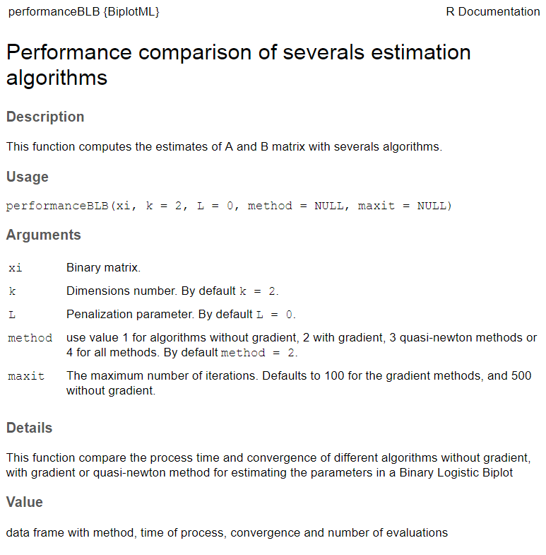
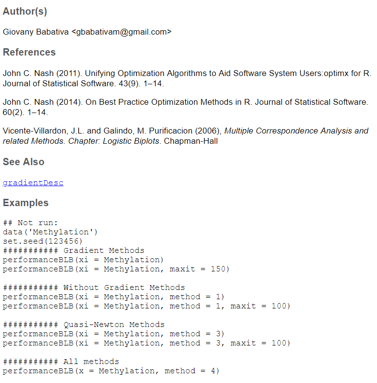

```{r setup, include=FALSE}
options(htmltools.dir.version = FALSE)
knitr::opts_chunk$set(warning = FALSE, message = FALSE, 
  comment = NA, dpi = 300, echo = FALSE,
  fig.align = "center", out.width = "60%", cache = FALSE,
  fig.path = "figs/")
library(tidyverse)
library(gganimate)
library(xaringanExtra)
library(here)
library(kableExtra)
ozcols <- wesanderson::wes_palette("FantasticFox1")[c(2:3)]

options(htmltools.dir.version = FALSE)
library(RefManageR)
BibOptions(check.entries = FALSE, bib.style = "authoryear", style = "markdown", dashed = TRUE)

bib <- ReadBib(here("references.bib"))
```


```{r xaringan-themer, include=FALSE, warning=FALSE}
library(xaringanthemer)
style_duo_accent(
  primary_color = "#035AA6",
  secondary_color = "#03A696"
  )
#mono_accent(
#  base_color = "#43418A"
#  )
```

```{r xaringan-tile-view, echo=FALSE}
xaringanExtra::use_tile_view()
style_panelset(panel_tab_color_active = "blue")
```
```{r xaringan-logo, echo=FALSE}
xaringanExtra::use_logo(
  image_url = "https://upload.wikimedia.org/wikipedia/commons/7/72/Ujaencolor.jpg"
)
```


```{r}
# presionar w para encender o apagar la cámara durante la presentación
# Ctrl + Shift + w para cambiar de ubicación a la cámara durante la presentación
xaringanExtra::use_webcam()
```

# Métodos biplot

Sea $\mathbf{X}=\left(\mathbf{x}_1, \ldots, \mathbf{x}_n\right)^T$, con $\mathbf{x}_i \in \mathbb{R}^p$, $i=1, \ldots, n$, el objetivo es visualizar una matriz de datos mediante un sistema de coordenadas fila y columna. Si $rank(\mathbf{X})=r$, las coordenadas del biplot se pueden calcular usando la SVD, $\mathbf{X}=\mathbf{U}\Lambda\mathbf{V}^T$. Así, $\mathbf{X}= \mathbf{AB^{T}+E}$ donde $\mathbf{E}$ es la matriz que contiene los errores de la aproximación. 

Para un entero $k\leq r$, se obtiene la aproximación de rango $k$ más cercana a $\mathbf{X}$ como $\hat{\mathbf{X}} = \mathbf{U}_{(k)}\Lambda_{(k)}\mathbf{V}^T_{(k)}=\mathbf{AB}^T$, donde $\mathbf{A} =\mathbf{U}_{(k)}\Lambda_{(k)}^\gamma$ y $\mathbf{B}=\mathbf{V}\Lambda_{(k)}^{(1-\gamma)}, 0 \leq \gamma \leq 1$; así, $\hat{\mathbf{X}}$ minimiza la norma de Frobenius definida como

\begin{equation}
\left|\left|\mathbf{X}-\hat{\mathbf{X}}\right|\right|_F^2=\sum_{i=1}^{n}\left|\left|\mathbf{x}_i- \left(\mathbf{a}_{i1}\mathbf{b}_1+\ldots+\mathbf{a}_{ik}\mathbf{b}_k\right)\right|\right|^2.
\end{equation}

De esta manera, la matriz $\mathbf{X}$ es representada por marcadores $\mathbf{a_1, \ldots, a_n}$ para las filas y $\mathbf{b_1, \ldots, b_r}$ para las columnas, donde el $ij$-ésimo elemento de la matriz denotado $x_{ij}$ es aproximado por el producto $\mathbf{a^{T}_ib_j}$ y el espacio natural de parámetros está determinado por $\mathbf{\Theta} = \mathbf{A}\mathbf{B}^T$.

---
# Biplot logístico binario


Sea $\mathbf{X}=\left(\mathbf{x}_1, \ldots, \mathbf{x}_n\right)^T$, con $\mathbf{x}_i \in \{0, 1\}^p$, $i=1, \ldots, n$, con $rank(\mathbf{X})=r$ y $x_{ij} \sim Ber(\pi(\theta_{ij}))$, donde $\pi(\cdot)$ es la inversa de la función de enlace, donde usaremos $\pi(\theta_{ij}) = \left\{1+exp(-\theta_{ij})\right\}^{-1}$, que representa la probabilidad de que la característica $j$ se encuentre presente en el individuo $i$.

--
A partir de la distribución probabilidad se tiene
$$P(X_{ij}=x_{ij}) = \pi(\theta_{ij})^{x_{ij}}\left( 1 - \pi(\theta_{ij})\right)^{1-x_{ij}}.$$

--

La función de verosimilitud es
$$\textit{L} (\mathbf{X}; \mathbf{\Theta}) = \prod_{i=1}^n\prod_{j=1}^p \pi(\theta_{ij})^{x_{ij}}\left( 1 - \pi(\theta_{ij})\right)^{1-x_{ij}}.$$

De modo que el negativo del log-verosimilitud se escribe como

$$\mathcal{L}\left(\mathbf{\Theta}\right) = -\sum_{i=1}^n\sum_{j=1}^p \left[ x_{ij} log(\pi(\theta_{ij})) + (1-x_{ij})log(1-\pi(\theta_{ij}))\right].$$

`r Citet(bib, "Villardon2006")` usan un algoritmo de Newton-Raphson para estimar los parámetros, pero este enfoque eventualmente puede converger a mínimos locales.

---

# Biplot logístico binario

El log-odds de $\pi(\theta_{ij})$ es $\theta_{ij}$ con $\theta_{ij}=log\left\{\pi(\theta_{ij})/(1-\pi(\theta_{ij}))\right\}$, que corresponde al parámetro natural de una distribución Bernoulli expresada en forma de familia exponencial. La matriz canónica de parámetros naturales es $\mathbf{\Theta}=\left(\mathbf{\theta}_1, \ldots, \mathbf{\theta}_n \right)^T$. Como en este caso no es apropiado centrar las columnas, se extiende la especificación del espacio de parámetros al introducir el vector de desplazamiento $\mu$ y así tener un centrado basado en el modelo, que se representa como:

$$\mathbf{\Theta} = logit\left(\mathbf{\Pi}\right) = \mathbf{1}_n \mu^T + \mathbf{AB}^T,$$

donde $\mathbf{\Theta} = logit(\mathbf{\Pi})$ es un biplot en escala logit; $\mathbf{A}=\left(\mathbf{a_1, \ldots, a_n}\right)^T$ con $\mathbf{a_i} \in \mathbb{R}^k, i=1, \ldots n$;  $\mathbf{B}=\left(\mathbf{b_1, \ldots, b_k}\right)$ con $\mathbf{b_j} \in \mathbb{R}^p, j=1, \ldots k$; y $\mathbf{\Pi}=\pi\left(\mathbf{\Theta}\right)$ es la matriz de valores predichos. 

--

La dirección que proyecta los marcadores de $\mathbf{A}$ que predicen los valores de la columna $j$ para una probabilidad fija $\pi$ cuando $k=2$ (`r Citet(bib, "Gower1996")`; `r Citet(bib, "Villardon2006")`).

$$d_1=\frac{(logit(\pi) - \mu_{j})b_{j1}}{\sum_{k=1}^2 b_{jk}^2}, \hspace{1cm} d_2=\frac{(logit(\pi) - \mu_{j})b_{j2}}{\sum_{k=1}^2 b_{jk}^2}.$$

---

# Función de pérdida

$$\mathcal{L}\left(\mathbf{\Theta}\right) = -\sum_{i=1}^n\sum_{j=1}^p \left[ x_{ij} log(\pi(\theta_{ij})) + (1-x_{ij})log(1-\pi(\theta_{ij}))\right] = \sum_{i=1}^n\sum_{j=1}^p f(\theta_{ij})$$
--

Cuando la función de enlace logit es utilizada, $\pi(\theta_{ij})=(1-\exp(-\theta_{ij}))^{-1}$, de modo que el gradiente se obtiene como

\begin{align}
\nabla f(\theta_{ij}) & = -\left[x_{ij} \frac{1}{\pi(\theta_{ij})}\frac{\partial \pi(\theta_{ij}) }{\partial \theta_{ij}} + (1-x_{ij})\frac{1}{1-\pi(\theta_{ij})}\frac{\partial (1-\pi(\theta_{ij})) }{\partial \theta_{ij}}\right] \nonumber\\
& = -\left[x_{ij} (1 - \pi(\theta_{ij}))  - (1-x_{ij})\pi(\theta_{ij})\right]\\
& = \pi(\theta_{ij})-x_{ij}. \nonumber 
\end{align}

--

De este modo, el gradiente de $\mathcal{L}\left(\mathbf{\Theta}\right)$ se expresa en términos matriciales como

$$\nabla \mathcal{L} = \mathbf{\Pi}  - \mathbf{X}.$$

---
# Algoritmos implementados

Se desarrolló el paquete *BiplotML* que incluye 4 tipos de algoritmos
.pull-left[

```{r, out.width= '90%'}

```
]
--
.pull-right[ 

- Búsquedas sin usar el gradiente.
  - Nelder-Mead `r Citep(bib, "NeldMead65")`.
  - uobyqa `r Citep(bib, "powell2002")`.
  - nweuoa `r Citep(bib, "powell2008")`. 
- Direcciones de búsqueda basadas en el gradiente.
  - Descenso del gradiente.
  - Gradiente Conjugado: Fletcher-Reeves, Polak-Ribiere, Beale-Sorenson, Dai-Yuan.
- Métodos de cuasi-Newton.
  - Broyden, Fletcher, Goldfarb y Shanno (BFGS).
- Coordenadas descendentes mediante algoritmo MM.
]
---

# Paquete **BiplotML**

```{r, echo=TRUE, eval=FALSE}
install.packages("devtools")
devtools::install_github("jgbabativam/BiplotML")
library(BiplotML)
```

```{r echo=FALSE, out.width="60%"}
knitr::include_graphics("images/GitHub.png")
```

---
# Documentación del paquete

```{r, eval=FALSE, echo=TRUE}
?performanceBLB
```


.pull-left[
```{r echo=FALSE, out.width="85%"}

```
]
--
.pull-right[
```{r echo=FALSE, out.width="85%"}

```
]

---

#Algoritmo del descenso del gradiente

.pull-left[

El algoritmo se basa en actualizar cada parámetro $\mathbf{\Theta} = (\theta_{1},\ldots,\theta_n)^T$ usando una velocidad o tasa de aprendizaje $\alpha$:

\begin{align}
\mathbf{A}_{k+1} & := \mathbf{A}_k + \alpha \left[\mathbf{\Pi} - \mathbf{X}\right]\mathbf{B}_k  \nonumber  \\
\mathbf{B}_{k+1} & := \mathbf{B}_k + \alpha \left[\mathbf{\Pi} - \mathbf{X}\right]^T\mathbf{A}_k \\
\mu_{k+1} & := \mu_k + \alpha \left[\mathbf{\Pi} - \mathbf{X}\right]^T\mathbf{1}_n \\
\mathbf{\Theta}_{k+1} & = \mathbf{1}_n \mu^T_{k+1} + \mathbf{A_{k+1}B_{k+1}}^T
\end{align}
]
--
.pull-right[ 

```{r, out.width= '95%'}
knitr::include_graphics("images/gradient-descent.png")
```
]

La cantidad de parámetros a estimar son $n k + p(k + 1)$.
La velocidad de aprendizaje, $\alpha$ debe elegirse manualmente.

---
# Algoritmo del descenso del gradiente

```{r xaringan-panelset, echo=FALSE}
xaringanExtra::use_panelset()
```

.panelset[
.panel[.panel-name[Código en R]

```{r panel-chunk, fig.show='hide', echo=TRUE}
library(BiplotML)
data(Methylation)

set.seed(02052020)
outGD <- gradientDesc(x = Methylation, k=2, rate = 0.001, converg=0.001, max_iter=10000)
```
]

.panel[.panel-name[Marcadores]

La salida es una lista que contiene las matrices $\mathbf{A}$ y $\mathbf{B}$, dentro de esta última, la primera columna corresponde a los efectos principales $\mu$. Acá `head(outGD$Ahat)` son los marcadores de las primeras 6 líneas celulares y `head(outGD$Bhat)` para los marcadores de las columnas.

.pull-left[
```{r, echo=FALSE}
A <- head(outGD$Ahat)

knitr::kable(A,  align = "lcc", digits = 3) %>% 
       kable_styling(bootstrap_options = "striped", full_width = F)
```
]

.pull-right[
```{r B_GD, echo=FALSE}
B <- head(outGD$Bhat)
colnames(B) <- c("$\\mu$" ,"$\\mathbf{b_1}$", "$\\mathbf{b_2}$")
knitr::kable(B, align = "ccc", digits = 3) %>% 
       kable_styling(bootstrap_options = "striped", full_width = F)
```
] 

]

.panel[.panel-name[Biplot]

```{r, out.width = "40%", echo=FALSE}
set.seed(02052020)
outGD <- gradientDesc(x = Methylation, k=2, max_iter=10000, plot = TRUE)
```
]
]
---
# Velocidad de aprendizaje


--

- Estrategia de búsqueda en línea: $\min_{\alpha > 0} \mathcal{L}\left(\mathbf{\Theta} + \alpha d_k \right).$
- Condiciones de Wolfe: condición de Armijo y de curvatura.

---
# Algoritmos de gradiente conjugado

1. Partir de un punto $\mathbf{\theta}_0$.
2. A partir del gradiente identificar la dirección de descenso con mayor pendiente, $d^T_k$, 
3. Usando una búsqueda en línea, calcular $\alpha_k$ para identificar el mínimo aproximado de $\mathcal{L}\left(\mathbf{\Theta}\right)$ a lo largo de $d_k$, garantizando que se cumplan las _condiciones de Wolfe_.
4. Usar un parámetro $\beta_k$ como regla para la actualización de la dirección basada en el gradiente. 

5. Actualizar de forma simultánea al espacio natural de parámetros $\mathbf{\Theta}$, que se obtiene al actualizar $\mu$, $\mathbf{A}$ y $\mathbf{B}$.

--

Por ejemplo, para la matriz de marcadores fila, el algoritmo se actualiza en el paso $k+1$ como
$$\mathbf{A}_{k + 1} = \mathbf{A}_k + \alpha_k d_k,$$
donde
\begin{equation}
d_k = \begin{cases} - \nabla \mathcal{L}_k \hspace{3.0cm} \text{si } k=0, \\ - \nabla \mathcal{L}_k + \beta_kd_{k-1} \hspace{0.5cm} \text{si } k \geq 1,  \end{cases} 
\end{equation}

con $\nabla \mathcal{L}_k = \nabla \mathcal{L}\left(\mathbf{\Theta}_k\right)$; $\beta_k$ es un escalar y $\alpha_k > 0$ es la velocidad de aprendizaje obtenida por una búsqueda en línea y requiere que se cumplan las _condiciones fuertes de Wolf_ 
---

# Algoritmos de gradiente conjugado

El paquete **BiplotML** cuenta con la implementación de los algoritmos del gradiente conjugado para un biplot logístico binario, el usuario tiene la opción de elegir entre el método de Fletcher-Reeves (FR), Polak-Ribiere-Polyak (PRP), Hestenes-Stiefel (HS) y Dai-Yuan (DY).


\begin{align}
\beta_k^{FR}=\frac{\left\lVert \nabla \mathcal{L}_k\right\rVert^2}{\left\lVert \nabla \mathcal{L}_{k-1} \right\rVert^2}; \hspace{0.5cm} \beta_k^{PRP}=\frac{\nabla \mathcal{L}_k^T\Delta_{k-1}}{\left\lVert \nabla \mathcal{L}_{k-1} \right\rVert^2}; \\ 
\beta_k^{HS}=\frac{\nabla \mathcal{L}_k^T\Delta_{k-1}}{d_{k-1}^T\Delta_{k-1}}; \hspace{0.5cm} \beta_k^{DY}=\frac{\left\lVert \nabla \mathcal{L}_k\right\rVert^2}{d_{k-1}^T\Delta_{k-1}} \hspace{0.5cm} . 
\end{align}

donde $\Delta_{k-1}=\nabla \mathcal{L}_k-\nabla \mathcal{L}_{k-1}$ y $\left\lVert \cdot  \right\rVert$ se refiere a la norma euclideana.

---

# Algoritmo del gradiente conjugado

```{r xaringan-panelset2, echo=FALSE}
xaringanExtra::use_panelset()
```

.panelset[
.panel[.panel-name[Código en R]

```{r CG, fig.show='hide', echo=TRUE, eval=FALSE}
#... Fletcher-Reeves (FR)
LogBip.FR <- bootBLB(x = Methylation, method = "CG", type = 1, ellipses = FALSE)

#... Polak-Ribiere-Polyak
LogBip.PR <- bootBLB(x = Methylation, method = "CG", type = 2, ellipses = FALSE)
```
]

.panel[.panel-name[Biplot]

.pull-left[
```{r, out.width = "85%", echo=FALSE}
library(ggplot2)
library(ggrepel)
library(dplyr)
source("G:/Mi unidad/Packages/BiplotML/R/plotBLB.R")
load(file = here("data/CG_FR.rda"))
g1 <- plotBLB(x = LB.FR, ellipses = FALSE)
g1
```
]

.pull-right[
```{r, out.width = "85%", echo=FALSE}
load(file = here("data/CG_PR.RData"))
g2 <- plotBLB(x = LB.PR, ellipses = FALSE)
g2
```
] 

]

.panel[.panel-name[Ajuste]

```{r, echo = FALSE}
fitFR <- LB.FR$fit
fitPR <- LB.PR$fit
knitr::kable(list(fitFR, fitPR),  align = "cccc", digits = 1) %>% 
       kable_styling(bootstrap_options = "striped", full_width = F)
```
]
]

---

# Algoritmo MM

Como el problema de minimización es no convexo, la función de pérdida puede ser mayorizada a una función cuadrática y así minimizar la función mayorizada. Usando linealización de Taylor se demuestra que 

$$\mathcal{L}\left(\mathbf{\Theta}\right) \leq \frac{1}{8}\sum_{i=1}^n\sum_{j=1}^p\left(\theta_{ij} - z_{ij}^{(l)}\right)^2 + C,$$
donde $C$ es una constante que no depende de $\mathbf{\Theta}$, y $z_{ij}^{(l)} = \theta_{ij}^{(l)} + 4(x_{ij} - \pi(\theta_{ij}^{(l)}))$. Sea $\mathbf{Z}_{l}$ la matriz con el elemento $ij$ igual a $z_{ij}^{(l)}$, entonces: 


$$\mathcal{L}\left(\mathbf{\Theta}\right) \leq \frac{1}{8}\left|\left|\mathbf{\Theta}-\mathbf{Z}_{l}\right|\right|_F^2 + C,$$

De modo que la función a minimizar es

$$\left|\left|\mathbf{1}_n\mu^T + \mathbf{AB}^T-\mathbf{Z}_{l}\right|\right|_F^2$$

---
# Estudio de Monte Carlo: Modelos a comparar

```{r xaringan-panelset45, echo=FALSE}
xaringanExtra::use_panelset()
```

.panelset[
.panel[.panel-name[Gradiente conjugado]

```{r echo=FALSE, out.width="60%"}
knitr::include_graphics("images/AlgoGradiente.png")
```
]

.panel[.panel-name[MM]

```{r echo=FALSE, out.width="60%"}
knitr::include_graphics("images/AlgoMM.png")
```
]
]

---
# Simulación de matrices de datos

El modelo de variables latentes con diferentes grados de imbalance y con una estructura de baja dimensión. 

```{r echo=FALSE, out.width="80%"}
knitr::include_graphics("images/AlgoSimBin.png")
```


---
# Evaluación del Modelo

Se compara el desempeño de los algoritmos basados en el gradiente conjugado con el algoritmo MM. Cada uno proporciona a $\hat{\mu}, \hat{\mathbf{A}}$ y $\hat{\mathbf{B}}$. A partir de la matriz de probabilidades predicha $\mathbf{\Pi}=\pi\left(\mathbf{\mathbf{1}_n\hat{\mu}^T + \hat{\mathbf{A}}\hat{\mathbf{B}}^T}\right)$ y se seleccionan $p$ umbrales, uno por cada columna de $\mathbf{X}$, para luego realizar la clasificación binaria y calcular el error de entrenamiento definido como Balanced Accuracy (BACC):

$$BACC = \frac{1}{2}\left(\frac{TP}{TP+FN} + \frac{TN}{TN+FP}\right)$$

Usando un esquema de validación cruzada con eliminación diagonal se evalúa la capacidad que tienen los modelos de identificar la estructura de dimensión reducida y así estimar el hiperparámetro $k$. Este procedimiento se realiza $M=7$ veces. 

---
# Resultados


```{r xaringan-panelset5, echo=FALSE}
xaringanExtra::use_panelset()
```

.panelset[
.panel[.panel-name[D=0.5]

```{r echo=FALSE, out.width="61%"}
knitr::include_graphics("images/cv50-1.png")
```
]

.panel[.panel-name[D=0.3]

```{r echo=FALSE, out.width="61%"}
knitr::include_graphics("images/cv30-1.png")
```
]

.panel[.panel-name[D=0.2]

```{r echo=FALSE, out.width="61%"}
knitr::include_graphics("images/cv20-1.png")
```
]

.panel[.panel-name[D=0.1]

```{r echo=FALSE, out.width="61%"}
knitr::include_graphics("images/cv10-1.png")
```
]

]

---
background-image: url(https://upload.wikimedia.org/wikipedia/commons/2/21/Flag_of_Colombia.svg)
background-size: 100px
background-position: 90% 8%

# Análisis de comorbilidades COVID-19

```{r, echo=TRUE, eval=FALSE}
library(BiplotML)
bip.com <- BiplotML::LogBip(x = dico, method = "MM")
```

```{r echo=FALSE, out.width="40%"}

```
Se usaron datos del [INS](https://www.ins.gov.co/Paginas/Inicio.aspx) sobre 144 fallecidos por Covid-19 con fines ilustrativos.

---
background-image: url(images/LogBip.png)
background-size: contain
---
background-image: url(images/LogBipSex.png)
background-size: contain
---
background-image: url(images/LogBipTedad.png)
background-size: contain
---
background-image: url(images/LogBipXDpto.png)
background-size: contain

---

# Referencias

```{r, results='asis', echo=FALSE}
PrintBibliography(bib)
```

---

class: center, middle

# Gracias!

Diapositivas realizadas con el paquete R [**xaringan**](https://github.com/yihui/xaringan).
