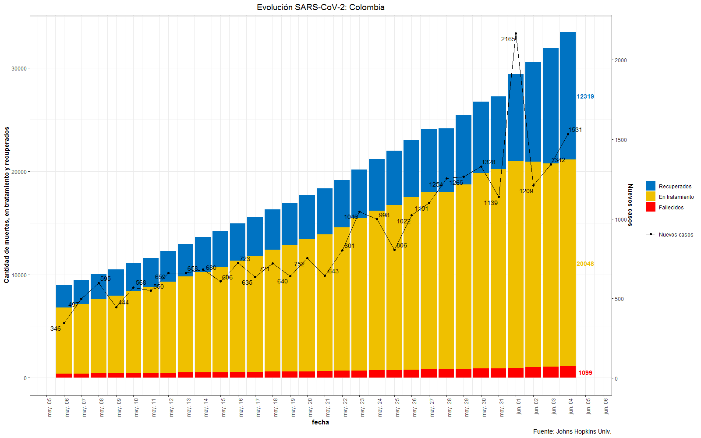

```{r setup, include=FALSE}
options(htmltools.dir.version = FALSE)
knitr::opts_chunk$set(warning = FALSE, message = FALSE, 
  comment = NA, dpi = 300, echo = FALSE,
  fig.align = "center", out.width = "60%", cache = FALSE,
  fig.path = "figs/")
library(tidyverse)
library(gganimate)
ozcols <- wesanderson::wes_palette("FantasticFox1")[c(2:3)]
```

```{r xaringan-themer, include=FALSE, warning=FALSE}
library(xaringanthemer)
style_duo_accent(
  primary_color = "#035AA6",
  secondary_color = "#03A696"
  )
#mono_accent(
#  base_color = "#43418A"
#  )
```


# Introducción

La estadística es una ciencia que tiene impacto en la toma de decisiones para diferentes sectores<sup>1
--

- **Mediciones de audiencia**: diseño de muestra maestra - diarios de audiencia/people meters.

--

- **Sector Financiero**: modelos de riesgo, segmentación, prevención de fraude - `phishing`.

--

- **Marketing**: decisiones de publicidad y mercadeo - `Brand Equity`, `Satisfacción de clientes`...

--

- **Evaluación de políticas públicas**: continuidad, focalización o ampliación.

--

- **Evaluación de la educación**: Pruebas `PISA` muestreo `SISPPS`, calificación `TRI`, cambio de cuadernillo en pruebas de estado `Saber 11`.

--

- **Salud**: prevención de consumo SPA, modelos en epidemiología, test de nuevos fármacos. 

.footnote[
[1] Los campos son mucho más amplios que los mencionados acá.
]

---

# Marketing

Las decisiones que se toman en marketing son diversas
```{r echo=FALSE, out.width="80%"}
knitr::include_graphics("images/Marketing.png")
```
---
# Evaluación de políticas públicas

```{r}
set.seed(1234)
x <- rnorm(1000, mean = 250, sd = 100) %>% as.data.frame()  %>% 
      mutate(tratado = ifelse(. > 348, 1, 0))

x1 <- subset(x, tratado == 1)
x2 <- subset(x, tratado == 0)

x1$y <- rnorm(nrow(x1), mean = 70, sd = 10) 
x2$y <- rnorm(nrow(x2), mean = 30, sd = 10)

df <- rbind(x1, x2)
colnames(df) <- c("x", "tratado", "y")
```

```{r, echo=TRUE, eval=FALSE}
df %>% 
  ggplot(aes(x, y, color = as.factor(tratado)))+
  geom_point() + geom_smooth( method = 'lm') + theme_bw() + theme(legend.position = "none")
```
--
.pull-left[
```{r, echo=FALSE}
df %>% 
  ggplot(aes(x, y, color = as.factor(tratado)))+
  geom_point() + geom_smooth( method = 'lm') + theme_bw() + theme(legend.position = "none")
```
]

.pull-right[ 

Problema de regresión discontínua **Ser Pilo Paga**, la variable $x$ representa el puntaje en la prueba `Saber 11` mientras que las variable $y$ representa alguna variable de resultado.

$$y_i = \alpha +\beta_1 x_i +\beta_2T_i + \epsilon_i$$
$$H_0: \beta_2 = 0; H_a: \beta_2 > 0 $$

- Ancho de banda.

- Medición de la línea de base.

]
---

# Evaluación de políticas públicas

Las investigaciones suelen ser de tipo experimental o cuasi-experimental, en estos casos se cuenta con un grupo control. _Programas como comedores comunitarios, familias en acción, vivienda gratuita, mejoramiento de barrios..._

.pull-left[
```{r echo=FALSE, out.width="100%"}
knitr::include_graphics("images/difdif.png")
```
]
--
.pull-right[ 
- El parámetro de interés es: 

$$\theta = (\mu_{T_2} - \mu_{C_2}) - (\mu_{T_1} - \mu_{C_1})$$

- La hipótesis nula es que el programa no genera ningún impacto.
$$H_0: \theta = 0$$

- La hipótesis nula es que existe un impacto del programa.

$$H_a: \theta > 0$$

- El efecto mínimo esperado $\Delta > 0$ y la potencia mínima esperada, son los valores a considerar en el cálculo del tamaño de la muestra. 

]

---
# Evaluación de la Educación

Pruebas de estado **Saber 11**: un cambio de más de 50 años de historia

.pull-left[
```{r echo=FALSE, out.width="70%"}
knitr::include_graphics("images/cuadernillo.png")
```
]
--
.pull-right[ 
**Saber 11** calendario A: 
- Un millón doscientos mil cuadernillos.
- más de 80 formas diseñadas `BIB`.
- Impresión `offset` por plancha y plegado.
- Impresión `digital` + encuadernado.
- 48 páginas por cuadernillo 55 millones de hojas, 2.000 impresiones por minuto.
- Nombres y apellidos en todas las páginas.
- Tiempos de impresión y distribución de 20 días.
- Algoritmo basado en principios de `big data` - QR.
]
---

# Salud: SARS-CoV-2
El caricaturista [Toby Morris](https://twitter.com/XTOTL) realizó la siguiente ilustración que muestra la forma como evoluciona la pandemia

```{r, out.width= '70%'}
knitr::include_graphics("images/curve.gif")
```
---

# Tasa de reproducción
La tasa de reproducción $R_0$, se estima entre 2.5 y 3.5 para el SARS-CoV-2 [Spinoff](https://thespinoff.co.nz/) 

```{r, out.width= '70%'}
knitr::include_graphics("images/R0.gif")
```
---
background-image: url(https://upload.wikimedia.org/wikipedia/commons/2/21/Flag_of_Colombia.svg)
background-size: 100px
background-position: 90% 8%

# Casos confirmados en Colombia
Gráfica acumulada y en escala logarítmica

.pull-left[
```{r echo=FALSE, out.width="90%"}
knitr::include_graphics("images/CasosNal.png")
```
]
--
.pull-right[
```{r echo=FALSE, out.width="90%"}
knitr::include_graphics("images/logCasosNal.png")
```
]
---
background-image: url(images/comparapaises.png)
background-size: contain
---
background-image: url(https://upload.wikimedia.org/wikipedia/commons/2/21/Flag_of_Colombia.svg)
background-size: 100px
background-position: 90% 8%

# SARS-CoV-2 - últimos 30 días

```{r echo=FALSE, out.width="78%"}

```
---
background-image: url(https://upload.wikimedia.org/wikipedia/commons/0/05/Flag_of_Brazil.svg)
background-size: 100px
background-position: 90% 8%

# SARS-CoV-2 - últimos 30 días

```{r echo=FALSE, out.width="78%"}

```
---
background-image: url(https://upload.wikimedia.org/wikipedia/commons/3/3f/Bandera_de_M%C3%A9xico_Civil_2.svg)
background-size: 100px
background-position: 90% 8%

# SARS-CoV-2 - últimos 30 días

```{r echo=FALSE, out.width="78%"}

```
---
background-image: url(images/TasaDptal.gif)
background-size: contain
---

# Biplot Logístico: análisis de comorbilidades.

$\mathbf{X}_{n \times p}$ donde $x_{ij} \sim Ber(\pi(\theta_{ij}))$ y $\pi(\cdot)$ es la inversa de la función de enlace, que corresponde a $\pi(\theta_{ij}) = \left\{1+exp(-\theta_{ij})\right\}^{-1}$.

$$\textit{L} (\mathbf{X}; \Theta) = \prod_{i=1}^n\prod_{j=1}^p \pi(\theta_{ij})^{x_{ij}}\left( 1 - \pi(\theta_{ij})\right)^{1-x_{ij}}$$

--
La función de pérdida es
$$\mathcal{L}\left(\mathbf{\Theta}\right) = - log \textit{L} (\mathbf{X}; \Theta) = -\sum_{i=1}^n\sum_{j=1}^p \left[ x_{ij} log(\pi(\theta_{ij})) + (1-x_{ij})log(1-\pi(\theta_{ij}))\right].$$

Así el log-odds de $\pi(\theta_{ij})$ es $\theta_{ij}$ con $\theta_{ij}=log\left\{\pi(\theta_{ij})/(1-\pi(\theta_{ij}))\right\}$, que corresponde al parámetro natural de una distribución Bernoulli expresada en su forma de familia exponencial. La matriz canónica de parámetros naturales es $\mathbf{\Theta}=\left(\mathbf{\theta}_1, \ldots, \mathbf{\theta}_n \right)^T$  se representa como

$$\mathbf{\Theta} = logit\left(\mathbf{\Pi}\right) = \mathbf{1}_n\mu^T + \mathbf{AB}^T.$$

---

# Función de pérdida

$$\mathcal{L} = -\sum_{i=1}^n\sum_{j=1}^p \left[ x_{ij} log(\pi(\theta_{ij})) + (1-x_{ij})log(1-\pi(\theta_{ij}))\right] =\sum_{i=1}^n\sum_{j=1}^p f(\theta_{ij}).$$
--
Para una función de enlace logit, $\pi(\theta_{ij})=(1-\exp(-\theta_{ij}))^{-1}$

$$\nabla f(\theta_{ij})  = \pi(\theta_{ij})-x_{ij}.$$
$$\nabla^2 f(\theta_{ij}) = \pi(\theta_{ij})(1 - \pi(\theta_{ij})).$$
--
Expresando el gradiente en términos matriciales
$$\nabla \mathcal{L} =  \mathbf{\Pi}  - \mathbf{X}.$$
.footnote[[*] algoritmos basados en el gradiente conjugado y métodos de cuasi-newton han sido implementados en el paquete _BiplotML_.]

---

# Algoritmo BFGS

Se considera un modelo cuadrático de la función de pérdida en la iteración $k$
$$m_k(d) = \mathcal{L}_k + \nabla \mathcal{L}_k^T d + \frac{1}{2} d^T B_k d$$

--

$B_k$ es una matriz definida positiva que se actualiza en cada iteración. La dirección de actualización en el paso $k$ es
$$\mathbf{\Theta}_{k+1} = \mathbf{\Theta}_k + \alpha_k d_k,$$
donde $d_k =  -B_k^{-1} \nabla  \mathcal{L}_k$ y $\alpha_k$ la velocidad de aprendizaje que satisface las _condiciones de Wolfe_.

--

Usando la formula de Broyden, Fletcher, Goldfarb y Shanno (BFGS), la actualización para el biplot logístico binario es

$$B_{k+1} = B_{k} - \frac{B_k s_k s_k^T B_k}{s_k^T B_k s_k} + \frac{\Delta_k \Delta_k^T}{\Delta_k^T s_k},$$
con $\Delta_k = \nabla \mathcal{L}_{k+1} - \nabla \mathcal{L}_{k}$ y $s_k = \mathbf{\Theta}_{k+1} - \mathbf{\Theta}_{k} = \alpha_k d_k$.

---
background-image: url(https://upload.wikimedia.org/wikipedia/commons/2/21/Flag_of_Colombia.svg)
background-size: 100px
background-position: 90% 8%

# Análisis de comorbilidades 

```{r, echo=TRUE, eval=FALSE}
devtools::install_github("jgbabativam/BiplotML")
library(BiplotML)
bip.com <- BiplotML::bootBLB(x = dico, method = "BFGS")
```

```{r echo=FALSE, out.width="40%"}

```
---
background-image: url(images/LogBip.png)
background-size: contain
---
background-image: url(images/LogBipSex.png)
background-size: contain
---
background-image: url(images/LogBipTedad.png)
background-size: contain
---
background-image: url(images/LogBipXDpto.png)
background-size: contain

---
# Modelos


.pull-left[
*Modelos determinísticos*, Kermack \& McKendrick 1927<sup>1  

- SIR: Sanos, Infectados y Recuperados.
- SEIR: Agrega el compartimiento de expuestos.
- SEIRS: No supone inmunidad
```{r echo=FALSE, out.width="90%"}
knitr::include_graphics("images/SEIR.png")
```
.footnote[
[1] Imagen tomada de [data for science](https://medium.com/data-for-science)  .
]
]

--

.pull-right[ 
*Modelos estocásticos*
- [Institute for Health Metrics and Evaluation (IHME)](https://covid19.healthdata.org/mexico): propone un modelo con efectos mixtos no lineal que permite estimar la tasa de mortalidad, en la especificación del modelo se utiliza información sobre el distanciamiento social y covariables específicas sobre la ubicación.
- [Imperial College](https://www.imperial.ac.uk/mrc-global-infectious-disease-analysis/covid-19/report-13-europe-npi-impact/): proponen un modelo jerárquico bayesiano que permite estimar el número “real” de infectados además de inferir el impacto de las intervenciones no farmacéuticas para 11 países a partir de intervalos de credibilidad. 
]

---

class: center, middle

# Gracias!

Diapositivas realizadas con el paquete R [**xaringan**](https://github.com/yihui/xaringan).

---

class: inverse, right, bottom


# Encuéntrame en...

[`r icon::fa("twitter")` @jgbabativam](http://twitter.com/jgbabativam)  
[`r icon::fa("github")` @jgbabativam](http://github.com/jgbabativam)  
[`r icon::fa("paper-plane")` jgbabativam@usal.es](mailto:jgbabativam@usal.es)