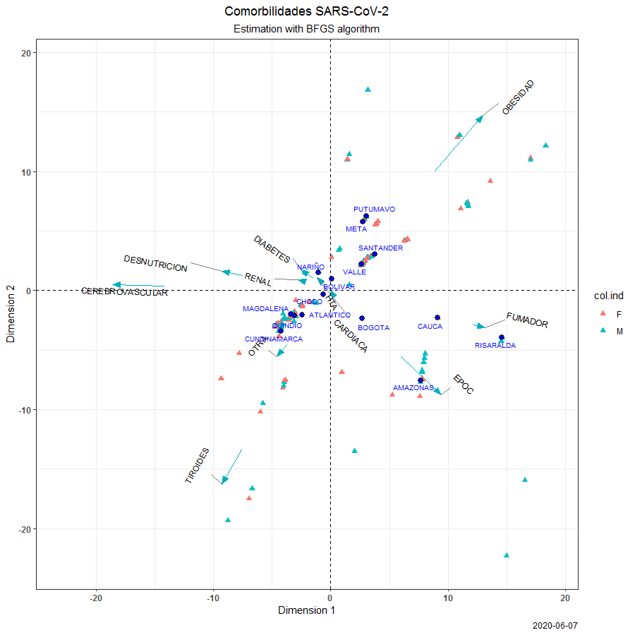
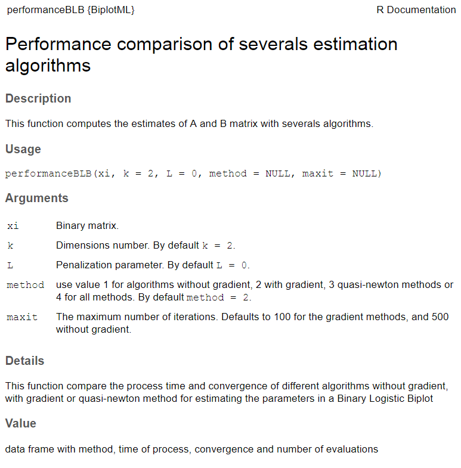
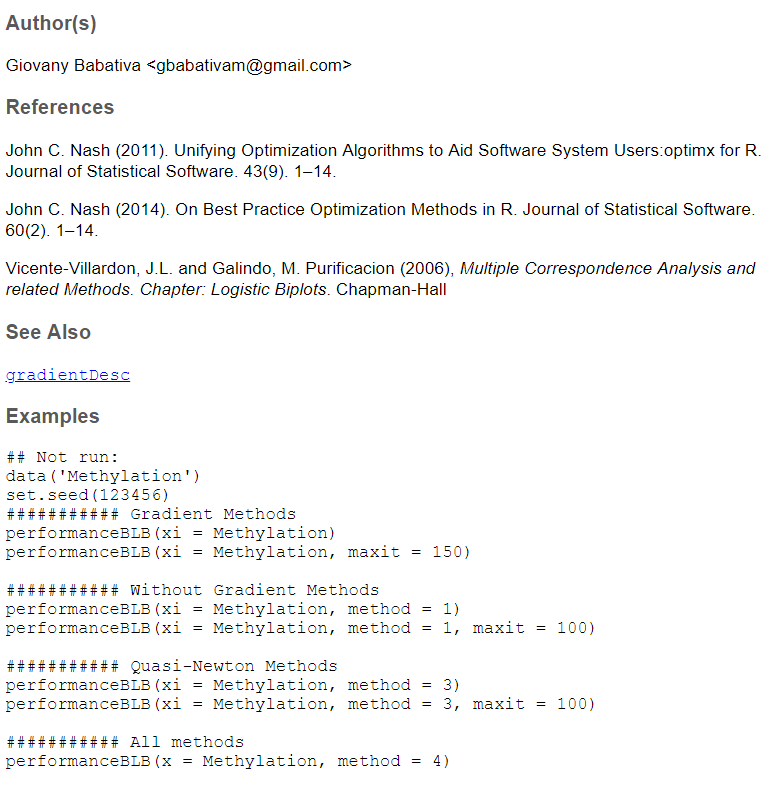
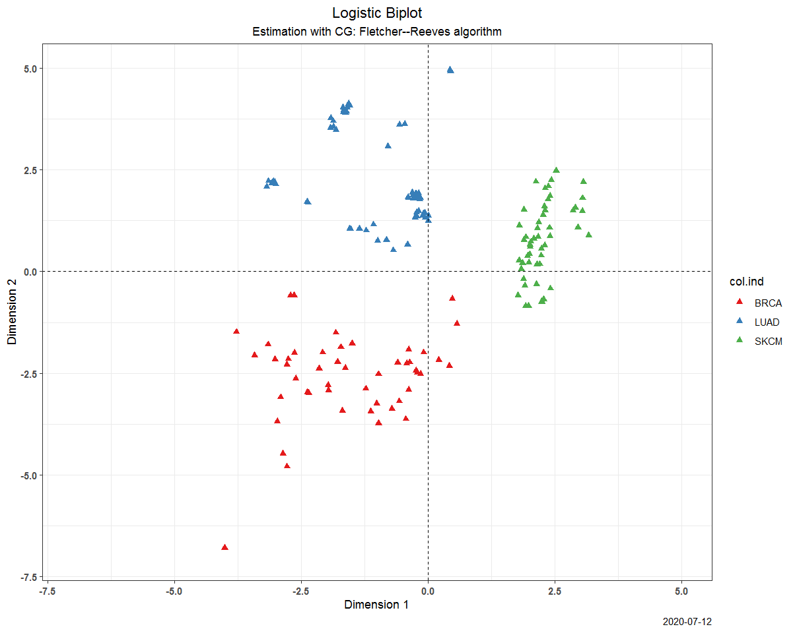
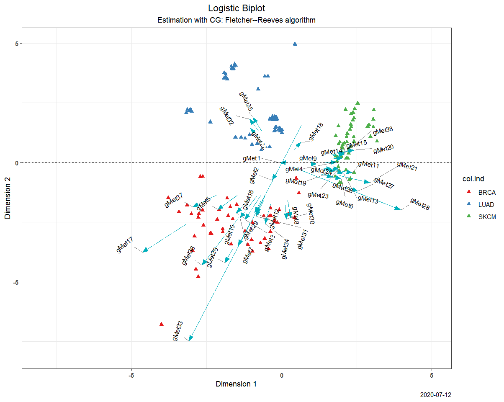
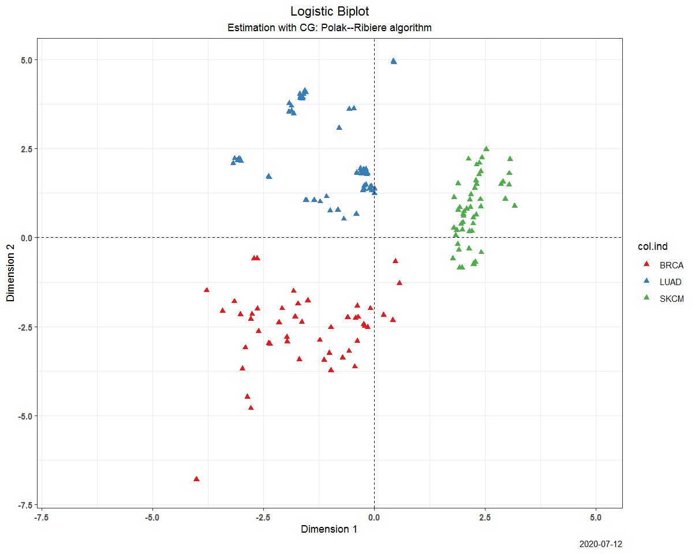
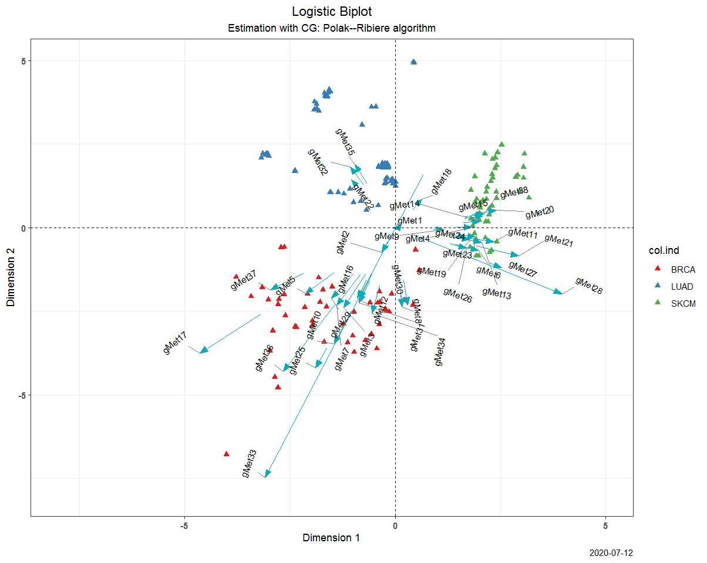
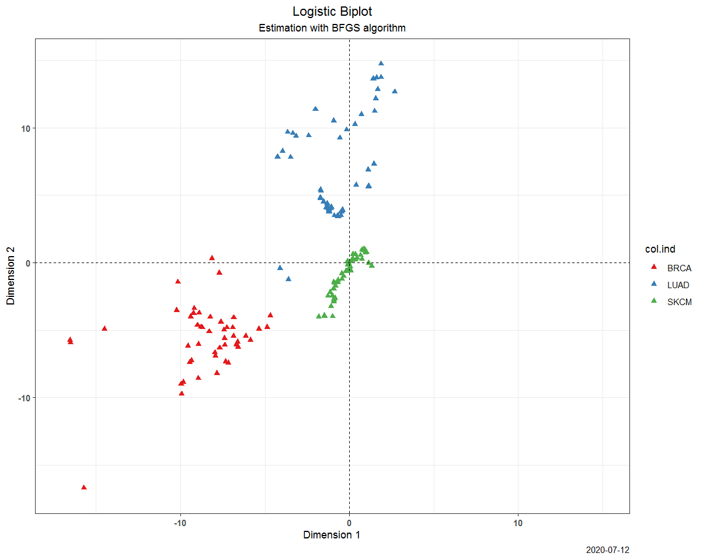
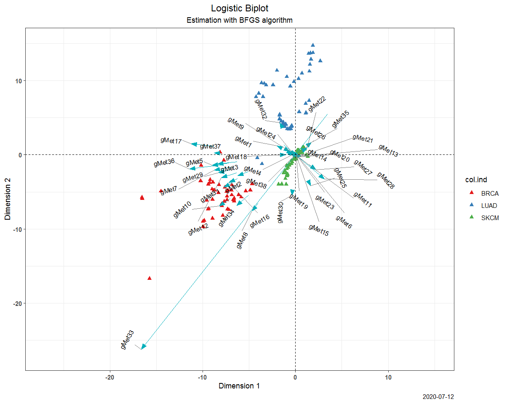

```{r setup, include=FALSE}
options(htmltools.dir.version = FALSE)
knitr::opts_chunk$set(warning = FALSE, message = FALSE, 
  comment = NA, dpi = 300, echo = FALSE,
  fig.align = "center", out.width = "60%", cache = FALSE,
  fig.path = "figs/")
library(tidyverse)
library(gganimate)
library(xaringanExtra)
library(here)
library(kableExtra)
ozcols <- wesanderson::wes_palette("FantasticFox1")[c(2:3)]

options(htmltools.dir.version = FALSE)
library(RefManageR)
BibOptions(check.entries = FALSE, bib.style = "authoryear", style = "markdown", dashed = TRUE)

bib <- ReadBib(here("./references.bib"))
```


```{r xaringan-themer, include=FALSE, warning=FALSE}
library(xaringanthemer)
style_duo_accent(
  primary_color = "#035AA6",
  secondary_color = "#03A696"
  )
#mono_accent(
#  base_color = "#43418A"
#  )
```

```{r xaringan-tile-view, echo=FALSE}
xaringanExtra::use_tile_view()
style_panelset(panel_tab_color_active = "blue")
```
```{r xaringan-logo, echo=FALSE}
xaringanExtra::use_logo(
  image_url = "https://upload.wikimedia.org/wikipedia/commons/6/6b/Logotipo_Universidad_de_Salamanca.svg"
)
```


```{r}
# presionar w para encender o apagar la cámara durante la presentación
# Ctrl + Shift + w para cambiar de ubicación a la cámara durante la presentación
xaringanExtra::use_webcam()
```

# Objetivos

Implementar algunos algoritmos basados en el gradiente, libres del gradiente y métodos de cuasi-Newton para estimar los parámetros de un biplot logístico binario sin restricciones.

--

**Objetivos específicos**

-  Revisar en la literatura algunos algoritmos que sean libres del gradiente, otros que usen el gradiente y algunos basado en métodos de cuasi-Newton que permitan estimar los parámetros de un biplot logístico binario.

	
- Implementar los algoritmos en R para un biplot logístico binario y realizar una función que compare la convergencia y tiempo de procesamiento de los diferentes algoritmos.
	
- Escribir en R las funciones que permitan aplicar los algoritmos para estimar los parámetros y graficar el biplot asociado.
	
- Empaquetar las funciones diseñadas.
	
- Generar los archivos de ayuda para el manejo de las funciones dentro del paquete.
	
- Realizar una aplicación a un conjunto de datos para ilustrar los procedimientos y resultados.

---

# Introducción

Sea $\mathbf{X}=\left(\mathbf{x}_1, \ldots, \mathbf{x}_n\right)^T$, con $x_i \in \mathbb{R}^p$, $i=1, \ldots, n$, con $rank(\mathbf{X})=r$. La aproximación puede ser escrita como $\mathbf{X} = \mathbf{AB^{T}+E}$ y que para un entero $k\leq r$, se define 

$$\hat{\mathbf{X}} = \mathbf{U}_{(k)}\Lambda_{(k)}\mathbf{V}^T_{(k)}=\mathbf{AB}^T,$$ 
donde $\mathbf{U}_{(k)}=\left[\mathbf{u}_1, \ldots, \mathbf{u}_k\right]$ y $\mathbf{V}=\left[\mathbf{v}_1, \ldots, \mathbf{v}_k\right]$ son las matrices formadas por los $k$ vectores singulares por izquierda y por derecha de la matriz $\mathbf{X}$; $\Lambda$ es una matriz diagonal $k$-dimensional con los valores singulares ordenados de forma decreciente $\lambda_1\geq \ldots \geq \lambda_k > 0$. 

Así el $ij$-ésimo elemento de la matriz denotado $x_{ij}$ es aproximado por el producto $\mathbf{a^{T}_ib_j}$. Es usual utilizar una descomposición de valores singulares o métodos alternantes para la estimación de los marcadores de las filas y de las columnas.

---
# Biplot logístico binario


Sea $\mathbf{X}=\left(\mathbf{x}_1, \ldots, \mathbf{x}_n\right)^T$, una matriz binaria, con $x_i \in \mathbb{R}^p$, $i=1, \ldots, n$ y $x_{ij} \sim Ber(\pi(\theta_{ij}))$ con $\pi(\theta_{ij}) = \left\{1+exp(-\theta_{ij})\right\}^{-1}$, que representa la probabilidad de que la característica $j$ se encuentre presente en el individuo $i$.

--
A partir de la distribución probabilidad se tiene
$$P(X_{ij}=x_{ij}) = \pi(\theta_{ij})^{x_{ij}}\left( 1 - \pi(\theta_{ij})\right)^{1-x_{ij}}.$$

--

La función de verosimilitud es
$$\textit{L} (\mathbf{X}; \mathbf{\Theta}) = \prod_{i=1}^n\prod_{j=1}^p \pi(\theta_{ij})^{x_{ij}}\left( 1 - \pi(\theta_{ij})\right)^{1-x_{ij}}.$$

--

Así log-verosimilitud se escribe como

$$\mathcal{L}\left(\mathbf{\Theta}\right) = -\sum_{i=1}^n\sum_{j=1}^p \left[ x_{ij} log(\pi(\theta_{ij})) + (1-x_{ij})log(1-\pi(\theta_{ij}))\right].$$

`r Citet(bib, "Villardon2006")` usan un algoritmo de Newton-Raphson para estimar los parámetros, pero este enfoque eventualmente puede converger a mínimos locales.

---

# Biplot logístico binario

El log-odds de $\pi(\theta_{ij})$ es $\theta_{ij}$ con $\theta_{ij}=log\left\{\pi(\theta_{ij})/(1-\pi(\theta_{ij}))\right\}$, que corresponde al parámetro natural de una distribución Bernoulli expresada en forma de familia exponencial. La matriz canónica de parámetros naturales es $\mathbf{\Theta}=\left(\mathbf{\theta}_1, \ldots, \mathbf{\theta}_n \right)^T$  que se representa como

$$\mathbf{\Theta} = f(\mu, \mathbf{A}, \mathbf{B}) = logit\left(\mathbf{\Pi}\right) = \mathbf{1}_n \mu^T + \mathbf{AB}^T,$$

donde $\mathbf{\Theta} = logit(\mathbf{\Pi})$ es un biplot en escala logit; $\mathbf{A}=\left(\mathbf{a_1, \ldots, a_n}\right)^T$ con $\mathbf{a_i} \in \mathbb{R}^k, i=1, \ldots n$;  $\mathbf{B}=\left(\mathbf{b_1, \ldots, b_k}\right)$ con $\mathbf{b_j} \in \mathbb{R}^p, j=1, \ldots k$; y $\mathbf{\Pi}=\pi\left(\mathbf{\Theta}\right)$ es la matriz de valores predichos. 

--

La dirección $\mathbf{\beta}_j$ que proyecta los marcadores de $\mathbf{A}$ que predicen los valores de la columna $j$ para una probabilidad fija $\pi$ cuando $k=2$ (`r Citet(bib, "Gower1996")`; `r Citet(bib, "Villardon2006")`).

$$d_1=\frac{(logit(\pi) - \mu_{j})b_{j1}}{\sum_{k=1}^2 b_{jk}^2}, \hspace{1cm} d_2=\frac{(logit(\pi) - \mu_{j})b_{j2}}{\sum_{k=1}^2 b_{jk}^2}.$$

---

# Función de pérdida

$$\mathcal{L}\left(\mathbf{\Theta}\right) = -\sum_{i=1}^n\sum_{j=1}^p \left[ x_{ij} log(\pi(\theta_{ij})) + (1-x_{ij})log(1-\pi(\theta_{ij}))\right] = \sum_{i=1}^n\sum_{j=1}^p f(\theta_{ij})$$
--

Cuando la función de enlace logit es utilizada, $\pi(\theta_{ij})=(1-\exp(-\theta_{ij}))^{-1}$, de modo que el gradiente se obtiene como

\begin{align}
\nabla f(\theta_{ij}) & = -\left[x_{ij} \frac{1}{\pi(\theta_{ij})}\frac{\partial \pi(\theta_{ij}) }{\partial \theta_{ij}} + (1-x_{ij})\frac{1}{1-\pi(\theta_{ij})}\frac{\partial (1-\pi(\theta_{ij})) }{\partial \theta_{ij}}\right] \nonumber\\
& = -\left[x_{ij} (1 - \pi(\theta_{ij}))  - (1-x_{ij})\pi(\theta_{ij})\right]\\
& = \pi(\theta_{ij})-x_{ij}. \nonumber 
\end{align}

--

De este modo, el gradiente de $\mathcal{L}\left(\mathbf{\Theta}\right)$ se expresa en términos matriciales como

$$\nabla \mathcal{L} = \mathbf{\Pi}  - \mathbf{X}.$$

---
# Algoritmos implementados

Se desarrolló el paquete *BiplotML* que incluye 3 tipos de algoritmos
.pull-left[

```{r, out.width= '90%'}

```
]
--
.pull-right[ 

- Búsquedas sin usar el gradiente.
  - Nelder-Mead `r Citep(bib, "NeldMead65")`.
  - uobyqa `r Citep(bib, "powell2002")`.
  - nweuoa `r Citep(bib, "powell2008")`. 
- Direcciones de búsqueda basadas en el gradiente.
  - Descenso del gradiente.
  - Gradiente Conjugado: Fletcher-Reeves, Polak-Ribiere, Beale-Sorenson, Dai-Yuan.
- Métodos de cuasi-Newton.
  - Broyden, Fletcher, Goldfarb y Shanno (BFGS).
]
---

# Paquete **BiplotML**

```{r, echo=TRUE, eval=FALSE}
install.packages("devtools")
devtools::install_github("jgbabativam/BiplotML")
library(BiplotML)
```

```{r echo=FALSE, out.width="60%"}
knitr::include_graphics("images/GitHub.png")
```

---
# Documentación del paquete

```{r, eval=FALSE, echo=TRUE}
?performanceBLB
```


.pull-left[
```{r echo=FALSE, out.width="85%"}

```
]
--
.pull-right[
```{r echo=FALSE, out.width="85%"}

```
]

---

#Algoritmo del descenso del gradiente

.pull-left[

El algoritmo se basa en actualizar cada parámetro $\mathbf{\Theta} = (\theta_{1},\ldots,\theta_n)^T$ usando una velocidad o tasa de aprendizaje $\alpha$:

\begin{align}
\mathbf{A}_{k+1} & := \mathbf{A}_k + \alpha \left[\mathbf{\Pi} - \mathbf{X}\right]\mathbf{B}_k  \nonumber  \\
\mathbf{B}_{k+1} & := \mathbf{B}_k + \alpha \left[\mathbf{\Pi} - \mathbf{X}\right]^T\mathbf{A}_k \\
\mu_{k+1} & := \mu_k + \alpha \left[\mathbf{\Pi} - \mathbf{X}\right]^T\mathbf{1}_n \\
\mathbf{\Theta}_{k+1} & = \mathbf{1}_n \mu^T_{k+1} + \mathbf{A_{k+1}B_{k+1}}^T
\end{align}
]
--
.pull-right[ 

```{r, out.width= '95%'}
knitr::include_graphics("images/gradient-descent.png")
```
]

La cantidad de parámetros a estimar son $n k + p(k + 1)$.
La velocidad de aprendizaje, $\alpha$ debe elegirse manualmente.

---
# Algoritmo del descenso del gradiente

```{r xaringan-panelset, echo=FALSE}
xaringanExtra::use_panelset()
```

.panelset[
.panel[.panel-name[Código en R]

```{r panel-chunk, fig.show='hide', echo=TRUE}
library(BiplotML)
data(Methylation)

set.seed(02052020)
outGD <- gradientDesc(x = Methylation, k=2, rate = 0.001, converg=0.001, max_iter=10000)
```
]

.panel[.panel-name[Marcadores]

El objeto de salida es una lista que contiene las matrices $\mathbf{A}$ y $\mathbf{B}$, dentro de esta última, la primera columna corresponde a los efectos principales $\mu$. Acá `head(outGD$Ahat)` son los marcadores de las primeras 6 líneas celulares.

.pull-left[
```{r, echo=FALSE}
A <- head(outGD$Ahat)

knitr::kable(A,  align = "lcc", digits = 3) %>% 
       kable_styling(bootstrap_options = "striped", full_width = F)
```
]

.pull-right[
```{r B_GD, echo=FALSE}
B <- head(outGD$Bhat)
colnames(B) <- c("$\\mu$" ,"$\\mathbf{b_1}$", "$\\mathbf{b_2}$")
knitr::kable(B, align = "lcc", digits = 3) %>% 
       kable_styling(bootstrap_options = "striped", full_width = F)
```
] 

]

.panel[.panel-name[Biplot]

```{r, out.width = "40%", echo=FALSE}
set.seed(02052020)
outGD <- gradientDesc(x = Methylation, k=2, max_iter=10000, plot = TRUE)
```
]
]
---
# Velocidad de aprendizaje


--

- Estrategia de búsqueda en línea: $\min_{\alpha > 0} \mathcal{L}\left(\mathbf{\Theta} + \alpha d_k \right).$
- Condiciones de Wolfe: condición de Armijo y de curvatura.

---
# Algoritmos basados en el gradiente conjugado

1. Partir de un punto $\mathbf{\theta}_0$.
2. A partir del gradiente identificar la dirección de descenso con mayor pendiente, $d^T_k$, 
3. Usando una búsqueda en línea, calcular $\alpha_k$ para identificar el mínimo aproximado de $\mathcal{L}\left(\mathbf{\Theta}\right)$ a lo largo de $d_k$, garantizando que se cumplan las _condiciones de Wolfe_.
4. Usar un parámetro $\beta_k$ como regla para la actualización de la dirección basada en el gradiente. 

5. Actualizar de forma simultánea al espacio natural de parámetros $\mathbf{\Theta}$, que se obtiene al actualizar $\mu$, $\mathbf{A}$ y $\mathbf{B}$.

--

Por ejemplo, para la matriz de marcadores fila, el algoritmo se actualiza en el paso $k+1$ como
$$\mathbf{A}_{k + 1} = \mathbf{A}_k + \alpha_k d_k,$$
donde
\begin{equation}
d_k = \begin{cases} - \nabla \mathcal{L}_k \hspace{3.0cm} \text{si } k=0, \\ - \nabla \mathcal{L}_k + \beta_kd_{k-1} \hspace{0.5cm} \text{si } k \geq 1,  \end{cases} 
\end{equation}

con $\nabla \mathcal{L}_k = \nabla \mathcal{L}\left(\mathbf{\Theta}_k\right)$; $\beta_k$ es un escalar y $\alpha_k > 0$ es la velocidad de aprendizaje obtenida por una búsqueda en línea y requiere que se cumplan las _condiciones fuertes de Wolf_ 
---

# Algoritmos basados en el gradiente conjugado

El paquete **BiplotML** cuenta con la implementación de los algoritmos del gradiente conjugado para un biplot logístico binario, el usuario tiene la opción de elegir entre el método de Fletcher-Reeves (FR), Polak-Ribiere-Polyak (PRP), Hestenes-Stiefel (HS) y Dai-Yuan (DY).


\begin{align}
\beta_k^{FR}=\frac{\left\lVert \nabla \mathcal{L}_k\right\rVert^2}{\left\lVert \nabla \mathcal{L}_{k-1} \right\rVert^2}; \hspace{0.5cm} \beta_k^{PRP}=\frac{\nabla \mathcal{L}_k^T\Delta_{k-1}}{\left\lVert \nabla \mathcal{L}_{k-1} \right\rVert^2}; \\ 
\beta_k^{HS}=\frac{\nabla \mathcal{L}_k^T\Delta_{k-1}}{d_{k-1}^T\Delta_{k-1}}; \hspace{0.5cm} \beta_k^{DY}=\frac{\left\lVert \nabla \mathcal{L}_k\right\rVert^2}{d_{k-1}^T\Delta_{k-1}} \hspace{0.5cm} . 
\end{align}

donde $\Delta_{k-1}=\nabla \mathcal{L}_k-\nabla \mathcal{L}_{k-1}$ y $\left\lVert \cdot  \right\rVert$ se refiere a la norma euclideana.

---

# Algoritmo del gradiente conjugado

```{r xaringan-panelset2, echo=FALSE}
xaringanExtra::use_panelset()
```

.panelset[
.panel[.panel-name[Código en R]

```{r CG, fig.show='hide', echo=TRUE, eval=FALSE}
#... Fletcher-Reeves (FR)
LogBip.FR <- bootBLB(x = Methylation, method = "CG", type = 1, ellipses = FALSE)

#... Polak-Ribiere-Polyak
LogBip.PR <- bootBLB(x = Methylation, method = "CG", type = 2, ellipses = FALSE)
```
]

.panel[.panel-name[Biplot]

.pull-left[
```{r, out.width = "85%", echo=FALSE}
library(ggplot2)
library(ggrepel)
library(dplyr)
source("G:/Mi unidad/Packages/BiplotML/R/plotBLB.R")
load(file = here("data/CG_FR.rda"))
g1 <- plotBLB(x = LB.FR, ellipses = FALSE)
g1
```
]

.pull-right[
```{r, out.width = "85%", echo=FALSE}
load(file = here("data/CG_PR.RData"))
g2 <- plotBLB(x = LB.PR, ellipses = FALSE)
g2
```
] 

]

.panel[.panel-name[Ajuste]

```{r, echo = FALSE}
fitFR <- LB.FR$fit
fitPR <- LB.PR$fit
knitr::kable(list(fitFR, fitPR),  align = "cccc", digits = 1) %>% 
       kable_styling(bootstrap_options = "striped", full_width = F)
```
]
]

---
# Algoritmo BFGS

Se considera un modelo cuadrático de la función de pérdida en la iteración $k$
$$m_k(d) = \mathcal{L}_k + \nabla \mathcal{L}_k^T d + \frac{1}{2} d^T B_k d$$

--

$B_k$ es una matriz definida positiva que se actualiza en cada iteración. La dirección de actualización en el paso $k$ es
$$\mathbf{\Theta}_{k+1} = \mathbf{\Theta}_k + \alpha_k d_k,$$
donde $d_k =  -B_k^{-1} \nabla  \mathcal{L}_k$ y $\alpha_k$ la velocidad de aprendizaje que satisface las _condiciones de Wolfe_.

--

Usando la formula de Broyden, Fletcher, Goldfarb y Shanno (BFGS), la actualización para el biplot logístico binario es

$$B_{k+1} = B_{k} - \frac{B_k s_k s_k^T B_k}{s_k^T B_k s_k} + \frac{\Delta_k \Delta_k^T}{\Delta_k^T s_k},$$
con $\Delta_k = \nabla \mathcal{L}_{k+1} - \nabla \mathcal{L}_{k}$ y $s_k = \mathbf{\Theta}_{k+1} - \mathbf{\Theta}_{k} = \alpha_k d_k$.
---

# Algoritmo BFGS

```{r xaringan-panelset3, echo=FALSE}
xaringanExtra::use_panelset()
```

.panelset[
.panel[.panel-name[Código R]

```{r BFGS, out.width = "75%", echo=TRUE, eval=FALSE}
#... BFGS algorithm
set.seed(02052020)
res.LB <- LogBip(x = Methylation, method = "BFGS")
```

La función cuenta con otros argumentos
- `label.ind = TRUE`: Etiqueta a los marcadores fila.
- `col.ind`: Factor para agregar un color a los marcadores fila.
- `endsegm`: Por defecto en 0.75. 
- `draw = c("biplot", "ind", "var")`: Por defecto devuelve el biplot.

Y otros más que están documentados en `help(LogBip)`. 
]

.panel[.panel-name[Biplot]

```{r, out.width = "45%", echo=FALSE}
#... BFGS algorithm
set.seed(02052020)
res.LB <- LogBip(x = Methylation, method = "BFGS")
```
]

.panel[.panel-name[Ajuste]

```{r, echo = FALSE}
fitBFGS <- res.LB$fit
knitr::kable(fitBFGS,  align = "cccc", digits = 1) %>% 
       kable_styling(bootstrap_options = "striped", full_width = F)
```
]
]
---

# Convergencia y tiempo de procesamiento

```{r xaringan-panelset4, echo=FALSE}
xaringanExtra::use_panelset()
```

.panelset[
.panel[.panel-name[Código R]

Para comparar el desempeño computacional de los diferentes algoritmos, el paquete *BiplotML* cuenta la función `performanceBLB()` que permite comparar tiempo de procesamiento y evaluar la convergencia de los algoritmos.

```{r, eval = FALSE, echo=TRUE}
data('Methylation')
set.seed(02052020)

########### Without Gradient Methods
performanceBLB(xi = Methylation, method = 1, maxit = 100)

########### Gradient Methods
performanceBLB(xi = Methylation, maxit = 150)

########### Quasi-Newton Methods
performanceBLB(xi = Methylation, method = 3)

########### All methods
performanceBLB(x = Methylation, method = 4)
```
]

.panel[.panel-name[Desempeño]

```{r, echo=FALSE, warning=FALSE, message=FALSE}
########### All methods
res <- performanceBLB(x = Methylation, method = 4)
knitr::kable(res,  align = "ccccc", digits = 2) %>% 
       kable_styling(bootstrap_options = "striped", full_width = F) 
```
]
]

---
# Inferencia


```{r xaringan-panelset5, echo=FALSE}
xaringanExtra::use_panelset()
```

.panelset[
.panel[.panel-name[Bootstrap]

```{r echo=FALSE, out.width="70%"}
knitr::include_graphics("images/AlgoBootstrap.png")
```

]

.panel[.panel-name[Elipses]

```{r echo=FALSE, out.width="75%"}
knitr::include_graphics("images/AlgoRegion.png")
```
La función `bootBLB()` del paquete **BiploML** permite dibujar las regiones de confianza usando el argumento `ellipses = TRUE`.
]
]
---

# Inferencia

```{r, out.width = "40%", echo=TRUE}
data("Methylation")
set.seed(02052020)
LogBip.FR <- bootBLB(x = Methylation, method = "CG", type = 1, ellipses = TRUE)
```

---

# Aplicación

Se usaron los datos del [Genomic Determinants of Sensitivity in Cancer 1000 (GDSC1000)](https://www.cancerrxgene.org/gdsc1000/GDSC1000_WebResources/Home.html) de la investigación de `Iorio y col. (2016)`. Los datos contienen información sobre líneas celulares de cáncer provenientes de más de 11 mil tumores. Luego de un preprocesamiento, las muestras se resumieron en 1.001 líneas celulares para 30 tipos de cáncer que integran mutaciones somáticas, copia del número de alteraciones (CNA), metilaciones del DNA y cambios de expresión de génes. 

--

Para facilitar la interpretación se eligieron 3 tipos de cáncer:

- *BRCA*: Cáncer de mama.
- *LUAD*: Adenocarcinoma pulmonar que es un tipo de cáncer de pulmón.
- *SKCM*: Melanoma de piel; es uno de los cánceres de piel más agresivos.

Las tres matrices de interés con la información para los tres tipos de cáncer, quedaron con 160 líneas celulares, donde el conjunto de datos de mutación contiene 197 variables, mientras que el de CNA contiene 412 variables y el de mutación tiene 38 variables.

---

# Resultados Metilación: CG - Fletcher-Reeves

```{r xaringan-panelset6, echo=FALSE}
xaringanExtra::use_panelset()
```

.panelset[
.panel[.panel-name[Código R]

```{r, eval=FALSE, echo=TRUE}
library(BiplotML)
set.seed(1234)
#... Plano de los marcadores fila
Met.FR <- LogBip(xMethy %>% select(-`Cancer Type`), 
                 col.ind = xMethy$`Cancer Type`, endsegm = 0.90, draw = "ind")

#... Biplot
set.seed(1234)
bMet.FR <- LogBip(xMethy %>% select(-`Cancer Type`), 
                 col.ind = xMethy$`Cancer Type`, endsegm = 0.90)

```

]

.panel[.panel-name[Filas]

```{r echo=FALSE, out.width="50%"}

```

]

.panel[.panel-name[Biplot]

```{r echo=FALSE, out.width="50%"}

```
]
]


---

# Resultados Metilación: CG - Polak-Ribiere

```{r xaringan-panelset7, echo=FALSE}
xaringanExtra::use_panelset()
```

.panelset[
.panel[.panel-name[Código R]

```{r, eval=FALSE, echo=TRUE}
library(BiplotML)
set.seed(1234)
#... Plano de los marcadores fila
Met.PR <- LogBip(xMethy %>% select(-`Cancer Type`), 
                 col.ind = xMethy$`Cancer Type`, endsegm = 0.90, type = 2, draw = "ind")

#... Biplot
set.seed(1234)
bMet.PR <- LogBip(xMethy %>% select(-`Cancer Type`), 
                  col.ind = xMethy$`Cancer Type`, endsegm = 0.90, type = 2)

```

]

.panel[.panel-name[Filas]

```{r echo=FALSE, out.width="50%"}

```

]

.panel[.panel-name[Biplot]

```{r echo=FALSE, out.width="50%"}

```
]
]

---

# Resultados Metilación: BFGS

```{r xaringan-panelset8, echo=FALSE}
xaringanExtra::use_panelset()
```

.panelset[
.panel[.panel-name[Código R]

```{r, eval=FALSE, echo=TRUE}
library(BiplotML)
set.seed(1234)
#... Plano de los marcadores fila
Met.BFGS <- LogBip(xMethy %>% select(-`Cancer Type`), 
                    col.ind = xMethy$`Cancer Type`, method = "BFGS", endsegm = 0.90, draw = "ind")

#... Biplot
set.seed(1234)
bMet.BFGS <- LogBip(xMethy %>% select(-`Cancer Type`), 
                    col.ind = xMethy$`Cancer Type`, method = "BFGS", endsegm = 0.90)

```

]

.panel[.panel-name[Filas]

```{r echo=FALSE, out.width="50%"}

```

]

.panel[.panel-name[Biplot]

```{r echo=FALSE, out.width="50%"}

```
]
]
---

# Estadísticos de ajuste

```{r xaringan-panelset9, echo=FALSE}
xaringanExtra::use_panelset()
```

.panelset[
.panel[.panel-name[Ajuste]

```{r echo=FALSE, out.width="75%"}
knitr::include_graphics("images/resumenMethys.png")
```

]

.panel[.panel-name[Plot]

```{r echo=FALSE, out.width="60%"}
knitr::include_graphics("images/BoxPlotMethys.png")
```

]

.panel[.panel-name[Código R]

```{r, eval=FALSE, echo=TRUE}
fit <- bind_rows(list(Met.FR$fit %>% mutate(Algorithm = "F.R"),
                      Met.PR$fit %>% mutate(Algorithm = "P.R"),
                      Met.BFGS$fit %>% mutate(Algorithm = "BFGS")))

stat.sens <- fit %>% group_by(Algorithm) %>% 
             summarise(media = mean(Sensitivy),
                       sd = sd(Sensitivy),
                       min = min(Sensitivy),
                       P5 = quantile(Sensitivy, 0.05),
                       P25 = quantile(Sensitivy, 0.25),
                       P50 = quantile(Sensitivy, 0.50),
                       P75 = quantile(Sensitivy, 0.75)) %>% 
             ungroup() %>% 
             tibble::column_to_rownames("Algorithm")

tstat.sens <- data.table::transpose(stat.sens)
colnames(tstat.sens) <- rownames(stat.sens)
rownames(tstat.sens) <- colnames(stat.sens)
```

]
]


---

# Conclusiones 

1. Se escribió el paquete *BiplotML* donde se implementaron más de 10 algoritmos de estimación.

2. Se describen los procedimientos matemáticos que permiten adaptar los algoritmos del descenso del gradiente, cuatro fórmulas que usan el gradiente conjugado y el algoritmo de cuasi-Newton de Broyden, Fletcher, Goldfarb y Shanno (BFGS), para un biplot logístico binario.

3. Se propuso y se implementó una metodología de bootstrap no paramétrico para realizar la inferencia de los resultados obtenidos con un biplot logístico binario.

4. La función `performanceBLB()` que permite comparar la convergencia y el tiempo de procesamiento de los diferentes algoritmos.

5. Se usaron datos reales sobre mutaciones somáticas, copia del número de alteraciones (CNA) y metilaciones del DNA, provenientes de más de 11 mil tumores para 30 tipos de cáncer.

---

# Referencias

```{r, results='asis', echo=FALSE}
PrintBibliography(bib)
```

---

class: center, middle

# Gracias!

Diapositivas realizadas con el paquete R [**xaringan**](https://github.com/yihui/xaringan).
